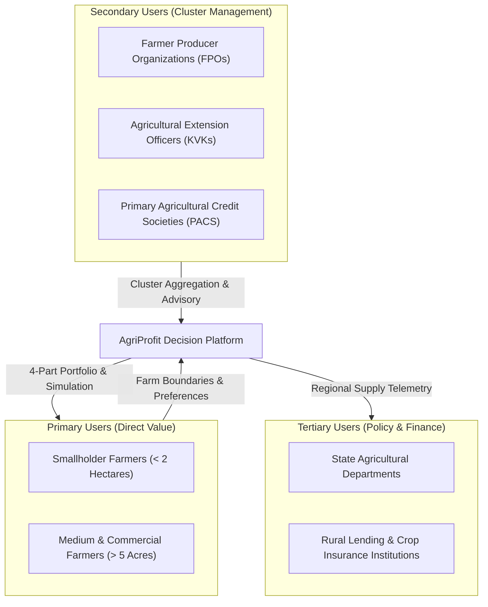
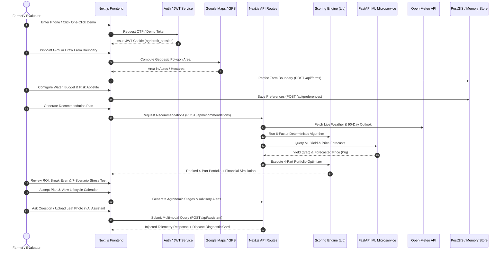
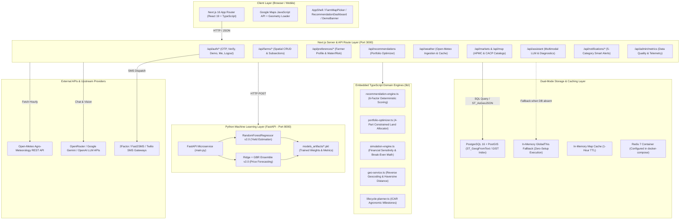

# AgriProfit: AI-Powered Smart Crop & Farm Profit Optimization Platform
## Comprehensive Repository Audit & Technical Project Profile Report

---

# 1. Project Title

* **Full Project Name:** AgriProfit — AI-Powered Smart Crop & Farm Profit Optimization Platform
* **Project Type:** Full-Stack Decision Support System (DSS) & Agro-Economic Optimization Platform
* **Domain:** Agricultural Technology (AgriTech) / Applied Artificial Intelligence / Geospatial Data Analytics
* **Problem Area:** Data-driven crop selection, multi-crop land allocation, agro-climatic risk mitigation, and farm profitability optimization for Indian agriculture
* **Target Users:** Smallholder and commercial farmers, Farmer Producer Organizations (FPOs), agricultural extension workers, and cooperative societies
* **Primary Objective:** Transform traditional intuition-based crop planning into an explainable, multi-factor, risk-hedged optimization process that maximizes expected net profit, return on investment (ROI), and agricultural resilience on farmer-drawn land parcels.

---

# 2. Executive Summary

Indian agriculture remains the economic backbone for over 50% of the country's workforce. However, agricultural decision-making at the individual farm level continues to suffer from severe information fragmentation. Smallholder and marginal farmers typically select crop varieties based on localized heuristics, unverified neighbor recommendations, or lagging market signals from preceding seasons. This cyclical behavior results in periodic commodity gluts, severe market price crashes, sub-optimal land utilization, and heightened vulnerability to localized climatic shocks.

**AgriProfit** is an end-to-end, full-stack decision-support system designed to solve this multi-variable optimization problem. The platform integrates interactive Google Maps geospatial parcel mapping (with geodesic area computation), live agro-meteorological forecasting (via Open-Meteo REST endpoints), benchmark APMC mandi market pricing, Government Minimum Support Price (MSP) floor benchmarks, a deterministic 6-factor agronomic scoring engine, a 4-part constrained portfolio land allocation optimizer, interactive financial sensitivity simulators, trained machine learning models for yield estimation and price forecasting, and a multimodal context-aware AI agronomist.

The core differentiator of AgriProfit lies in its **4-Part Portfolio Diversification Architecture**. Rather than suggesting a single monoculture crop that exposes the farmer to unhedged downside risk, the system dynamically divides the farmer's exact drawn acreage across four complementary strategic buckets:
1. **Part 1: Safety Floor ($20\% - 50\%$):** Assured procurement crops backed by Central Government MSP floor prices.
2. **Part 2: Stability & Profit ($25\% - 30\%$):** Dependable cash crops with established market liquidity and high margin-to-cost ratios.
3. **Part 3: High-Profit Opportunity ($15\% - 35\%$):** High-value horticultural or commercial crops capturing price momentum.
4. **Part 4: Soil Diversity & Restoration ($10\% - 20\%$):** Nitrogen-fixing legumes and pulses that restore soil organic matter and reduce subsequent fertilizer expenditures.

By grounding every recommendation in empirical agronomic parameters, transparent mathematical formulations, and verified benchmark data, AgriProfit provides Indian farmers with an actionable, risk-calibrated seasonal roadmap.

---

# 3. Problem Statement

Agricultural production in India faces several systemic challenges that limit smallholder profitability and sustainability:

1. **Reliance on Lagged & Informal Heuristics:** Crop planning is predominantly driven by preceding seasonal prices or informal advice, leading to synchronized overproduction (cobweb phenomenon) and subsequent market price collapse.
2. **High APMC Mandi Price Volatility:** Non-MSP commercial and horticultural commodities (e.g., onions, tomatoes, potatoes) experience intra-seasonal price swings exceeding $30\% - 50\%$, creating severe financial distress for unhedged farmers.
3. **Localized Meteorological Uncertainty:** Erratic monsoon distribution, terminal heat stress during grain filling, and unseasonal precipitation events directly impact yields unless matched with suitable crop phenology and sowing windows.
4. **Escalating Input Costs:** Rising prices of certified hybrid seeds, chemical fertilizers, irrigation energy, and seasonal labor squeeze farm margins, necessitating rigorous pre-season break-even analysis.
5. **MSP Information Gaps:** Despite official Minimum Support Price announcements across 22 mandated commodities, many smallholders lack awareness of localized procurement agency infrastructure (FCI, NAFED, CCI) and procurement windows.
6. **Lack of Farm-Specific Parcel Customization:** Existing state agricultural advisories provide broad district-wide recommendations that fail to account for a farmer's specific land size, water access (borewell, canal, rainfed), investment capital, and soil characteristics.

### Gap Analysis: Conventional Advisory Systems vs. AgriProfit

| Parameter | Conventional Advisory Systems | Proposed AgriProfit Platform |
|---|---|---|
| **Land Input** | Generic district/state level text advisory | Exact GPS polygon drawing with geodesic acreage calculation |
| **Recommendation Strategy** | Single-crop monoculture suggestion | 4-Part diversified portfolio allocation balancing safety and profit |
| **Market Integration** | Static wholesale price tickers | 6-month historical mandi trends, volatility ratings, and ML price forecasts |
| **Downside Protection** | Ignored or treated as secondary | Explicit MSP procurement floor safety weighting and 7-scenario stress simulation |
| **Financial Transparency** | Qualitative statements ("high yield") | Full deterministic financial simulation: gross revenue, total cost, net profit, break-even yield/price, ROI |
| **Explainability** | Black-box output | Decomposed 6-factor scoring breakdown with human-readable agronomic justifications |
| **Agronomic Lifecycle** | Generic printed pamphlets | Dynamic stage-by-stage milestone roadmap (DAS) with automated advisory notifications |
| **Diagnostic Support** | In-person extension visits (delayed) | Real-time multimodal AI agronomist for Hinglish query answering and leaf disease diagnosis |

---

# 4. Proposed Solution

AgriProfit delivers an integrated web platform that synthesizes geospatial, meteorological, market, agronomic, and financial data into a cohesive decision pipeline.

```text
┌─────────────────────────────────────────────────────────────────────────────┐
│                            AgriProfit Solution Flow                         │
├──────────────────────────────────┬──────────────────────────────────────────┤
│ 1. Geospatial Farm Definition    │ Geodesic polygon mapping & auto-acreage  │
│ 2. Farmer Parameter Calibration  │ Water access, risk profile, budget cap   │
│ 3. Multi-Source Ingestion        │ Open-Meteo weather + APMC + CACP MSP     │
│ 4. Deterministic 6-Factor Scoring│ Weather, Market, Profit, MSP, Cost, Soil │
│ 5. 4-Part Portfolio Optimizer    │ Safety, Stability, Opportunity, Diversity│
│ 6. Financial Sensitivity Engine  │ Revenue, Net Profit, ROI, Break-Even     │
│ 7. ML Predictive Microservice    │ Random Forest Yield + Ensemble Price     │
│ 8. Lifecycle & Advisory Center   │ Stage-by-stage milestones & AI pathology │
└──────────────────────────────────┴──────────────────────────────────────────┘
```

The solution enforces strict boundaries between:
* **Implemented Functionality:** Real interactive UI, geodesic area computation, rule-based recommendation engine, financial simulator, crop lifecycle planner, weather integration, mandi price catalogs, dual-layer repository persistence (PostGIS / Memory), FastAPI ML microservice with trained models, and multimodal LLM integration.
* **Conceptual / Future Functionality:** Direct automated satellite NDVI ingestion, physical IoT field sensor integration, direct e-NAM trade execution, and automated SMS telco delivery.

---

# 5. Project Objectives

1. **Precision Geospatial Farm Mapping:** Enable farmers to draw high-resolution farm boundaries using interactive satellite maps, automatically calculating land area in acres and hectares.
2. **Multi-Factor Agronomic & Economic Scoring:** Score eligible seasonal crops across six transparent dimensions: weather suitability ($25\%$), market opportunity ($20\%$), profitability ($20\%$), MSP safety ($15\%$), cost fit ($10\%$), and soil fit ($10\%$).
3. **Risk-Hedged Multi-Crop Allocation:** Implement a 4-part portfolio optimizer that divides land into safety floor, cash flow stability, profit upside, and soil regeneration segments.
4. **Deterministic Financial Modeling:** Provide real-time simulations calculating itemized input costs, gross revenue, net profit, ROI percentage, break-even price per quintal, and break-even yield per acre.
5. **Empirical ML Inference:** Serve trained Scikit-Learn models via FastAPI for data-driven crop yield prediction and forward mandi price forecasting.
6. **Agro-Meteorological Awareness:** Ingest live 7-day weather forecasts and 90-day seasonal norms from Open-Meteo, alerting farmers to extreme frost, heatwave, or heavy rain events.
7. **Stage-by-Stage Lifecycle Guidance:** Generate customized crop management timelines detailing irrigation windows (e.g., Crown Root Initiation), fertilizer top-dressing schedules, and pest monitoring thresholds.
8. **Contextual AI Agronomy Support:** Provide a conversational agronomist supporting Hindi, Romanized Hinglish, and English, paired with image-based leaf disease diagnosis.

---

# 6. Target Users



### 1. Primary Users: Smallholder and Commercial Farmers
* **Intended Benefit:** Eliminate monoculture price crash risk, ensure MSP safety floor coverage, understand exact input cost requirements, and receive timely agronomic stage guidance.
* **Implementation Status:** ✅ **Fully Implemented** via responsive Next.js web application with OTP/Demo authentication, map picker, recommendation dashboard, financial simulator, and AI assistant.

### 2. Secondary Users: FPOs and Agricultural Extension Workers
* **Intended Benefit:** Manage clusters of farmer plots, standardize crop rotation schedules across member lands, aggregate input purchasing, and provide localized pest advisories.
* **Implementation Status:** 🟡 **Partially Implemented** (FPO admin role defined in JWT schema and database; multi-farm management operational; aggregated bulk reporting is planned).

### 3. Tertiary Users: State Agricultural Departments & Credit Institutions
* **Intended Benefit:** Monitor regional crop distribution, project seasonal commodity supplies, reduce non-performing agricultural assets through pre-season viability checks, and verify PMFBY insurance coverage.
* **Implementation Status:** 🔵 **Configured / Planned** (Admin data quality and telemetry dashboard implemented with simulated system metrics; live district-wide aggregation planned).

---

# 7. Key Features & Evidence-Based Verification

| Feature | Description | Status | Source Code Evidence |
|---|---|---|---|
| **Geospatial Farm Mapping** | Pin & polygon drawing on Google Maps with centroid calculation | ✅ Implemented | `frontend/src/app/components/FarmMapPicker.tsx` |
| **Geodesic Area Calculation** | Computes land area in m², acres, and hectares via spherical geometry | ✅ Implemented | `frontend/src/app/components/FarmMapPicker.tsx:L78-88` |
| **SVG Fallback Mapping** | Interactive canvas/SVG drawing when Google Maps API key is unavailable | ✅ Implemented | `frontend/src/app/components/FarmMapPicker.tsx:L320-410` |
| **Land Sectioning** | Subdivides total acreage into distinct crop subsections | ✅ Implemented | `frontend/src/app/components/FarmMapPicker.tsx:L59-64`, `farms/repository.ts` |
| **Crop Catalog Discovery** | Comprehensive database of 25+ crops with agronomic and economic profiles | ✅ Implemented | `frontend/src/lib/crop-data.ts:L51-480`, `/api/crops` |
| **Weather Telemetry** | 7-day forecast, 90-day seasonal norms, extreme heat/frost alerts | ✅ Implemented | `frontend/src/lib/weather-service.ts:L212-317`, `/api/weather` |
| **APMC Mandi Intelligence** | Benchmark modal prices, 6-month historical time series, volatility ratings | ✅ Implemented | `frontend/src/lib/market-service.ts:L219-492`, `/api/markets` |
| **MSP Floor Benchmarking** | CACP 2024-25 MSP floor rates, procurement agencies, and C2 cost margins | ✅ Implemented | `frontend/src/lib/market-service.ts:L83-217`, `/api/msp` |
| **Deterministic Scoring Engine** | 6-factor weighted algorithm (0–100) with risk penalties | ✅ Implemented | `frontend/src/lib/recommendation-engine.ts:L226-306` |
| **4-Part Portfolio Optimizer** | Constrained multi-crop splitting (Safety, Stability, Upside, Diversity) | ✅ Implemented | `frontend/src/lib/portfolio-optimizer.ts:L239-505` |
| **Financial & ROI Simulation** | Exact math for revenue, itemized cost, net profit, ROI, and break-even | ✅ Implemented | `frontend/src/lib/simulation-engine.ts:L36-76` |
| **7-Scenario Stress Testing** | Stress-tests portfolio under drought, excess rain, heatwave, and price crash | ✅ Implemented | `frontend/src/lib/portfolio-optimizer.ts:L141-234` |
| **Crop Lifecycle Calendar** | Stage-by-stage agronomic milestones with DAS tracking and irrigation advice | ✅ Implemented | `frontend/src/lib/lifecycle-planner.ts:L65-210`, `/crop-plan` |
| **Advisory Notification Inbox** | 5-category smart alert dispatch (irrigation, weather, disease, market, stage) | ✅ Implemented | `frontend/src/lib/notification-service.ts`, `/notifications` |
| **Multimodal AI Agronomist** | LLM agronomist with Hinglish support, telemetry injection, and leaf pathology | ✅ Implemented | `frontend/src/lib/ai-assistant-service.ts:L434-509`, `/assistant` |
| **ML Crop Yield Prediction** | RandomForestRegressor trained on 7,000 ICAR rows ($R^2=0.9601$) | ✅ Implemented | `ml-service/app/models/yield_model.py`, `/predict/yield` |
| **ML Price Forecasting** | Ridge + GBR Ensemble trained on 19,500 APMC rows ($R^2=0.9733$) | ✅ Implemented | `ml-service/app/models/price_model.py`, `/predict/price` |
| **Admin Telemetry Dashboard** | Data quality matrix, feed freshness, API latency tracking | ✅ Implemented | `frontend/src/app/admin/page.tsx`, `lib/admin-service.ts` |
| **Dual-Mode Persistence** | PostgreSQL + PostGIS when configured; in-memory fallback for zero-setup | ✅ Implemented | `farms/repository.ts`, `preferences/repository.ts` |
| **SMS OTP Gateway** | Multi-gateway SMS dispatcher (2Factor, Fast2SMS, Twilio, MSG91) | 🟡 Partially Implemented | `frontend/src/lib/auth.ts:L205-346` (code wired, requires active gateway key) |
| **Direct PostGIS DB Execution** | Schema and migrations ready; Docker Compose orchestrates PostgreSQL 16 | 🟡 Partially Implemented | `database/init.sql`, `docker-compose.yml` (works when DB container is up) |
| **Satellite NDVI Vigor Ingestion** | High-resolution Sentinel-2 vegetation index monitoring | 🟣 Planned / Future | Architecture documented; no runtime imagery pipeline in repo |
| **IoT Soil Telemetry** | Real-time NPK and capacitance soil probe telemetry | 🟣 Planned / Future | Schema defined (`soil_health` table); no physical hardware bridge |

---

# 8. End-to-End Farmer Workflow



### Detailed Workflow Step Audit

| Step | Intended Behavior | Actual Repository Implementation | Current Status |
|---|---|---|---|
| **1. Registration & Auth** | Mobile number OTP login with 5-minute TTL and secure JWT session creation | `frontend/src/lib/auth.ts`: Web Crypto HMAC-SHA256 JWT, rate-limited OTP generator, multi-gateway SMS dispatcher (2Factor, Fast2SMS, Twilio, MSG91) with instant One-Click Demo evaluator bypass. | ✅ Implemented |
| **2. Farm Boundary Mapping** | Interactive GPS mapping, corner pinning, polygon creation, and centroid detection | `frontend/src/app/components/FarmMapPicker.tsx`: Google Maps JS API loader with satellite view, DrawingManager, browser GPS geolocation (`resolveDistrictFromCoords`), and fallback canvas tool. | ✅ Implemented |
| **3. Geodesic Area Calculation** | Exact spherical polygon area computation in m², hectares, and acres | `FarmMapPicker.tsx`: Uses `google.maps.geometry.spherical.computeArea` with automatic conversion ($1\text{ ha} = 2.47105\text{ ac}$). | ✅ Implemented |
| **4. Farmer Preferences** | Water availability, investment capacity, risk appetite, and crops to avoid/prefer | `frontend/src/app/preferences/page.tsx` & `api/preferences/repository.ts`: Form captures water access, budget, risk profile, and soil parameters. | ✅ Implemented |
| **5. External Data Collection** | Ingest localized weather, mandi prices, and MSP benchmarks | `frontend/src/lib/weather-service.ts` queries Open-Meteo REST API; `market-service.ts` loads curated Agmarknet time series and CACP MSP catalog. | ✅ Implemented |
| **6. Data Normalization** | Convert raw units to ₹/quintal, quintals/acre, and normalizes temperatures/rainfall | Implemented across `crop-data.ts`, `geo-service.ts`, and `market-service.ts`. | ✅ Implemented |
| **7. Multi-Factor Recommendation** | Score all eligible seasonal crops using transparent weighted factors | `frontend/src/lib/recommendation-engine.ts`: Evaluates weather, market, profit, MSP, cost, and soil fit, subtracting risk penalties. | ✅ Implemented |
| **8. Portfolio Optimization & Land Split** | Divide farm into 4 strategic buckets (Safety, Stability, Opportunity, Diversity) | `frontend/src/lib/portfolio-optimizer.ts`: Dynamically allocates land based on risk appetite (Conservative: 50/25/15/10; Balanced: 35/30/20/15; Growth: 20/25/35/20). | ✅ Implemented |
| **9. Economic & Sensitivity Simulation** | Compute revenue, cost, profit, break-even yield/price, and 7-scenario stress resilience | `frontend/src/lib/simulation-engine.ts` & `portfolio-optimizer.ts`: Computes exact mathematical figures and evaluates 7 climate/market stress scenarios. | ✅ Implemented |
| **10. Farmer Decision & Plan Acceptance** | Review recommendations, tune subsection sliders, and commit final plan | `frontend/src/app/recommendations/RecommendationDashboard.tsx` & `/recommendations/plan`: Interactive dashboard with sensitivity sliders and visual land breakdown. | ✅ Implemented |
| **11. Crop Lifecycle Guidance** | Stage-by-stage timeline with critical management milestones | `frontend/src/lib/lifecycle-planner.ts` & `/crop-plan`: 5-stage agronomic roadmap detailing sowing dates, CRI irrigation, and fertilization. | ✅ Implemented |
| **12. Advisory Alerts & AI Chat** | Timely notification inbox and context-aware multimodal assistant | `frontend/src/lib/notification-service.ts` & `ai-assistant-service.ts`: 5-category alert inbox and LLM assistant with leaf image pathology cards. | ✅ Implemented |

---

# 9. System Architecture



### Architectural Highlights

1. **Monorepo Structure:** Managed with `pnpm` workspaces, containing `frontend/`, `ml-service/`, `packages/shared`, `packages/ui`, `packages/api-client`, `database/`, `data/`, `datasets/`, `scripts/`, and `tests/`.
2. **Dual Persistence Strategy:** All core repositories (`farms/repository.ts`, `preferences/repository.ts`, `notifications/repository.ts`) implement dual storage:
   * **Production Mode (`DATABASE_URL` set):** Direct connection via `pg` Pool to PostgreSQL 16 with PostGIS spatial geometry indexing (`GIST(boundary)`).
   * **Development / Evaluator Mode (`DATABASE_URL` unset):** In-memory storage backed by `globalThis` maps, ensuring the entire platform functions out of the box without requiring local database infrastructure.
3. **Decoupled ML Microservice:** The Python FastAPI service runs independently on port `8000`, exposing `/predict/yield` and `/predict/price`, called by the frontend via HTTP REST.
4. **Multimodal AI Integration:** The Next.js `/api/assistant` endpoint integrates a multi-provider client that tries Gemini, OpenAI, and OpenRouter models in sequence, stripping reasoning traces (`<think>...</think>`) and falling back to ICAR-calibrated disease cards if offline.

---

# 10. Technology Stack Summary

| Layer | Technology | Purpose | Actual Usage |
|---|---|---|---|
| **Frontend Framework** | Next.js 16.3.2 (App Router) | Server and client application shell, routing, layouts, and API routes | **Used** |
| **Frontend UI Library** | React 19.2.8 + React DOM 19.2.8 | Component rendering, state management, and lifecycle hooks | **Used** |
| **Styling & CSS** | Tailwind CSS v4.0 + `@tailwindcss/postcss` | Utility-first responsive design, dark/light theme tokens | **Used** |
| **Language (Fullstack)** | TypeScript 5.x | Strict end-to-end type safety across frontend, backend, and tests | **Used** |
| **Maps & Geospatial** | `@googlemaps/js-api-loader` + Google Maps JS API | Satellite imagery, parcel drawing, and geodesic area calculation | **Used** |
| **Database Engine** | PostgreSQL 16 + PostGIS Extension | Spatial polygon storage (`GEOGRAPHY(POLYGON, 4326)`), centroids, relational records | **Used / Configured** |
| **Database Client** | Node `pg` (v8.23.0) | Direct PostgreSQL connection pooling with parameterized SQL queries | **Used** |
| **ML Runtime & Framework** | Python 3.11+ / FastAPI 0.110+ / Uvicorn | High-performance ASGI microservice serving ML inference endpoints | **Used** |
| **Machine Learning Libraries** | Scikit-Learn 1.4+, Pandas 2.2+, NumPy 1.26+, Joblib | Random Forest yield modeling, Ridge+GBR ensemble, feature encoding | **Used** |
| **AI / LLM Clients** | OpenRouter API / Google Gemini API / OpenAI API | Multimodal context-aware agronomist chat and leaf disease vision diagnostics | **Used** |
| **Weather Telemetry** | Open-Meteo REST API | Live 7-day temperature, rainfall, humidity, and WMO condition codes | **Used** |
| **Authentication** | Web Crypto API (HMAC SHA-256) | Zero-dependency JWT token generation, verification, and HTTP-only cookies | **Used** |
| **SMS Gateway Integration** | 2Factor.in / Fast2SMS / Twilio / MSG91 | Mobile OTP dispatch handlers | **Configured** |
| **Caching Layer** | In-Memory TTL Map Cache / Redis 7 (Docker) | In-memory 1-hour cache for weather; Redis configured in Docker Compose | **Used (In-Memory) / Configured (Redis)** |
| **Monorepo Build System** | Turbo / pnpm workspaces | Monorepo orchestration and shared package dependency management | **Used** |
| **Containerization** | Docker / Docker Compose (dev + prod) | Multi-container orchestration (Next.js + FastAPI + Postgres + Redis + Nginx) | **Configured** |
| **Reverse Proxy** | Nginx (Alpine) | Production port 80 routing (`/` to Next.js `:3000`, `/ml/` to FastAPI `:8000`) | **Configured** |
| **CI / CD Pipeline** | GitHub Actions (`ci.yml`, `ml-validation.yml`) | Automated typechecking, integration test execution, and ML validation | **Used** |

---

# 11. AI / Machine Learning Architecture

AgriProfit implements a layered, explainable AI architecture that combines deterministic agronomic rule systems, supervised machine learning pipelines, and multimodal large language models:

```text
┌─────────────────────────────────────────────────────────────────────────────┐
│                           AgriProfit Layered AI System                      │
├─────────────────────────────────────────────────────────────────────────────┤
│ 1. Deterministic Multi-Factor Agronomic Scoring Engine (TypeScript)         │
│    - 6-Factor Weighted Composite Score (0–100)                              │
│    - Rule-based risk penalties & agronomic compatibility constraints        │
├─────────────────────────────────────────────────────────────────────────────┤
│ 2. Constrained 4-Part Portfolio Optimizer (TypeScript)                      │
│    - Dynamic strategic bucket classification (Safety, Stability, Upside,    │
│      Diversity) based on risk profile                                       │
├─────────────────────────────────────────────────────────────────────────────┤
│ 3. Supervised Crop Yield Predictor (Python / Scikit-Learn v2.0)             │
│    - RandomForestRegressor (n_estimators=100, max_depth=12)                 │
│    - Trained on 7,000 synthetic ICAR rows (Test R²: 0.9601, MAE: 683 kg/ha) │
├─────────────────────────────────────────────────────────────────────────────┤
│ 4. Ensemble Mandi Price Forecaster (Python / Scikit-Learn v2.0)             │
│    - Weighted Ensemble: 50% Ridge + 50% GradientBoostingRegressor           │
│    - Trained on 19,500 APMC time-series rows (Test R²: 0.9733, MAPE: 3.79%) │
├─────────────────────────────────────────────────────────────────────────────┤
│ 5. Context-Aware Multimodal AI Agronomist (Next.js / OpenRouter / LLMs)     │
│    - Injects real-time farm boundary, active stage (DAS), weather, and price│
│    - ICAR-calibrated leaf disease diagnostic card generation                │
└─────────────────────────────────────────────────────────────────────────────┘
```

---

# 12. Recommendation & Scoring Engine Formulation

The recommendation engine computes composite suitability scores for all eligible candidate crops in the active season, mathematically formalizing agronomic and economic constraints.

### 1. Composite Crop Suitability Formula

$$\text{Composite Score} = \sum_{i=1}^{6} (w_i \cdot S_i) - P_{\text{risk}}$$

Where the factor weights ($w_i$) are strictly defined as:
* $w_1 = 0.25$ : Weather Suitability Score ($S_{\text{weather}} \in [10, 100]$)
* $w_2 = 0.20$ : Market Opportunity Score ($S_{\text{market}} \in [15, 100]$)
* $w_3 = 0.20$ : Profitability Score ($S_{\text{profit}} \in [20, 100]$)
* $w_4 = 0.15$ : MSP / Procurement Safety Score ($S_{\text{msp}} \in [40, 95]$)
* $w_5 = 0.10$ : Cost Fit Score ($S_{\text{cost}} \in [35, 95]$)
* $w_6 = 0.10$ : Soil Fit Score ($S_{\text{soil}} \in [80, 100]$)
* $P_{\text{risk}}$ : Risk Penalty ($+50$ if crop in `cropsToAvoid`, $-10$ bonus if in `preferredCrops`)

$$\text{Final Score} = \min\Big(98, \, \max\big(15, \, \text{round}(\text{Composite Score})\big)\Big)$$

---

### 2. Factor Score Sub-Formulas

#### A. Weather Suitability ($S_{\text{weather}}$)
$$\text{Base} = 75$$
$$S_{\text{temp}} = \begin{cases} +15 & \text{if } T_{\text{curr}} \in [T_{\text{ideal\_min}}, T_{\text{ideal\_max}}] \\ +5 & \text{if } T_{\text{curr}} \in [T_{\text{min}}, T_{\text{max}}] \setminus [T_{\text{ideal\_min}}, T_{\text{ideal\_max}}] \\ -20 & \text{otherwise} \end{cases}$$
$$S_{\text{water}} = \begin{cases} -35 & \text{if } \text{Crop}_{\text{water}} = \text{High} \land \text{Farm}_{\text{water}} = \text{Low} \\ +15 & \text{if } \text{Crop}_{\text{water}} = \text{Low} \land \text{Farm}_{\text{water}} = \text{Low} \\ +10 & \text{if } \text{Crop}_{\text{water}} = \text{High} \land \text{Farm}_{\text{water}} = \text{High} \\ 0 & \text{otherwise} \end{cases}$$
$$S_{\text{weather}} = \min\big(100, \max(10, \text{Base} + S_{\text{temp}} + S_{\text{water}})\big)$$

#### B. Market Opportunity ($S_{\text{market}}$)
$$\text{Base} = 60$$
$$S_{\text{trend}} = \begin{cases} +20 & \text{if } \Delta P_{30\text{d}} > 5\% \\ +10 & \text{if } 0\% < \Delta P_{30\text{d}} \le 5\% \\ -15 & \text{if } \Delta P_{30\text{d}} < -5\% \\ 0 & \text{otherwise} \end{cases}$$
$$S_{\text{vol}} = \begin{cases} +10 & \text{if Volatility} = \text{Low} \\ -10 & \text{if Volatility} = \text{High} \\ 0 & \text{if Volatility} = \text{Medium} \end{cases}$$
$$S_{\text{benchmark}} = \begin{cases} +10 & \text{if } P_{\text{modal}} \ge P_{\text{typical}} \\ 0 & \text{otherwise} \end{cases}$$
$$S_{\text{market}} = \min\big(100, \max(15, \text{Base} + S_{\text{trend}} + S_{\text{vol}} + S_{\text{benchmark}})\big)$$

#### C. Profitability Score ($S_{\text{profit}}$)
$$\text{Base} = 50$$
$$S_{\text{roi}} = \begin{cases} +30 & \text{if } \text{ROI} \ge 3.0 \\ +20 & \text{if } 2.0 \le \text{ROI} < 3.0 \\ +10 & \text{if } 1.5 \le \text{ROI} < 2.0 \\ 0 & \text{otherwise} \end{cases}$$
$$S_{\text{net}} = \begin{cases} +20 & \text{if Net Profit per Acre} > \text{₹}50,000 \\ +10 & \text{if } \text{₹}25,000 < \text{Net Profit per Acre} \le \text{₹}50,000 \\ 0 & \text{otherwise} \end{cases}$$
$$S_{\text{profit}} = \min\big(100, \max(20, \text{Base} + S_{\text{roi}} + S_{\text{net}})\big)$$

#### D. MSP Safety Score ($S_{\text{msp}}$)
$$S_{\text{msp}} = \begin{cases} 95 & \text{if } \text{mspEligible} = \text{true} \land \text{mspPrice} > 0 \\ 40 & \text{if } \text{mspEligible} = \text{false} \text{ (Free Market)} \end{cases}$$

---

### 3. Four-Part Portfolio Splitting Strategy

The total farm area ($A_{\text{total}}$) is partitioned across four strategic buckets:

$$A_{\text{total}} = A_{\text{safety}} + A_{\text{stability}} + A_{\text{opportunity}} + A_{\text{diversity}}$$

The allocation percentage vector $\vec{P} = \begin{bmatrix} p_{\text{safety}} & p_{\text{stability}} & p_{\text{opportunity}} & p_{\text{diversity}} \end{bmatrix}$ is dynamically determined by the farmer's risk appetite:

| Risk Profile | Part 1: Safety (MSP Floor) | Part 2: Stability (Cash Flow) | Part 3: Opportunity (High Margin) | Part 4: Diversity (Soil Legume) |
|---|---|---|---|---|
| **Conservative** | $50\%$ | $25\%$ | $15\%$ | $10\%$ |
| **Balanced** | $35\%$ | $30\%$ | $20\%$ | $15\%$ |
| **Growth** | $20\%$ | $25\%$ | $35\%$ | $20\%$ |

---

### 4. Deterministic Financial Simulation Engine

For any allocated crop parcel with area $A$ (acres), expected yield $Y$ (q/acre), market selling price $P$ (₹/quintal), and input cost $C$ (₹/acre):

$$\text{Gross Revenue (₹)} = A \cdot Y \cdot P$$
$$\text{Total Cost (₹)} = A \cdot C$$
$$\text{Net Profit (₹)} = \text{Gross Revenue} - \text{Total Cost}$$
$$\text{ROI Multiplier} = \frac{\text{Gross Revenue}}{\text{Total Cost}}$$
$$\text{ROI Percentage} = \left(\frac{\text{Net Profit}}{\text{Total Cost}}\right) \times 100\%$$
$$\text{Break-Even Selling Price (₹/q)} = \frac{C}{Y}$$
$$\text{Break-Even Yield (q/acre)} = \frac{C}{P}$$

---

### 5. Seven-Scenario Monte Carlo Stress Testing

The engine subjects the computed portfolio to seven realistic climatic and economic shock scenarios:

| Scenario | Revenue Multiplier ($M_{\text{rev}}$) | Cost Multiplier ($M_{\text{cost}}$) | Simulated Revenue | Simulated Cost |
|---|---|---|---|---|
| **Normal Baseline** | $1.00$ | $1.00$ | $\text{Rev} \times 1.00$ | $\text{Cost} \times 1.00$ |
| **Monsoon Deficit ($-30\%$ Rain)** | $0.82$ | $1.05$ | $\text{Rev} \times 0.82$ | $\text{Cost} \times 1.05$ |
| **Excess Rain / Waterlogging ($+40\%$)** | $0.88$ | $1.08$ | $\text{Rev} \times 0.88$ | $\text{Cost} \times 1.08$ |
| **Late Heatwave ($+3^\circ\text{C}$)** | $0.85$ | $1.02$ | $\text{Rev} \times 0.85$ | $\text{Cost} \times 1.02$ |
| **Mandi Correction ($-20\%$ Price)** | $0.80$ | $1.00$ | $\text{Rev} \times 0.80$ | $\text{Cost} \times 1.00$ |
| **Mandi Crash ($-30\%$ Open Market)** | $0.70$ | $1.00$ | $\text{Rev} \times 0.70$ | $\text{Cost} \times 1.00$ |
| **Input Cost Inflation ($+20\%$ Cost)** | $1.00$ | $1.20$ | $\text{Rev} \times 1.00$ | $\text{Cost} \times 1.20$ |

---

# 13. Data Sources and Datasets Audit

| Dataset File | Source / Baseline | Purpose | Format | Consumed By | Status |
|---|---|---|---|---|---|
| `01_states_districts.csv` | Survey of India / ICAR Zones | 28 district reference coordinates and agro-climatic zone mapping | CSV | `geo-service.ts`, `init.sql` | ✅ Active in Code |
| `02_climate_regions.csv` | Köppen Climate / IMD Grids | Climate region classifications per district | CSV | `init.sql`, ML pipelines | ✅ Active in Code |
| `03_crops_master.csv` | ICAR Packages / CACP 2024-25 | 25+ crops with temperature, water, duration, yield, and input costs | CSV | `crop-data.ts`, `init.sql`, ML models | ✅ Active in Code |
| `04_crop_lifecycle_calendar.csv` | ICAR Extension Guides | Stage-by-stage growth phases (CRI, flowering, maturity) | CSV | `lifecycle-planner.ts`, `init.sql` | ✅ Active in Code |
| `05_weather_climate_daily.csv` | IMD 2-year daily telemetry | Meteorological training data for ML yield models | CSV | ML Yield training pipeline | ✅ Active in ML |
| `06_mandi_prices.csv` | Agmarknet / e-NAM daily prices | 19,500 daily arrival and modal price records | CSV | ML Price training pipeline | ✅ Active in ML |
| `07_msp_data.csv` | CACP / DA&FW Gazette 2020–2025 | Official Minimum Support Price benchmarks across 22 commodities | CSV | `market-service.ts`, `init.sql` | ✅ Active in Code |
| `08_trade_data.csv` | FAOSTAT / UN Comtrade | Export/import commodity volumes and YoY trade demand index | CSV | ML Price training pipeline | ✅ Active in ML |
| `09_soil_health.csv` | Soil Health Card scheme | NPK, pH, and organic carbon samples across soil types | CSV | `init.sql`, ML Yield model | ✅ Active in ML |
| `10_notifications.csv` | Synthetic template alerts | Pre-seeded smart notification examples | CSV | `init.sql`, seed scripts | ✅ Active in DB |
| `Open-Meteo REST API` | Live Open-Meteo Server | Real-time 7-day hourly/daily weather and WMO conditions | JSON / REST | `weather-service.ts` | ✅ Active Runtime API |

> [!NOTE]
> **Data Lineage Disclosure:** In accordance with `datasets/metadata/DATA_DICTIONARY.md`, all row-level CSV training records are synthetic seed datasets algorithmically generated to match realistic Indian agricultural value ranges (CACP 2024-25 MSP releases, ICAR package of practices, and Agmarknet historical spreads). Live weather and LLM reasoning are ingested in real-time at runtime.

---

# 14. Database Design & Relational Schema

```text
┌───────────────────────────┐         ┌───────────────────────────┐
│          farmers          │ 1     * │           farms           │
├───────────────────────────┤─────────├───────────────────────────┤
│ farmer_id (PK)            │         │ farm_id / id (PK)         │
│ full_name                 │         │ farmer_id / owner_id (FK) │
│ district_id (FK)          │         │ area_acres / area_hectares│
│ phone_number_masked       │         │ center_lat, center_lng    │
│ registration_date         │         │ boundary (GEOGRAPHY-POLY) │
└───────────────────────────┘         │ centroid_geom (GEOG-POINT)│
                                      │ sections (JSONB)          │
                                      │ preferences (JSONB)       │
                                      └───────────────────────────┘
                                                    │ 1
                                                    │
                                                    │ *
                                      ┌───────────────────────────┐
                                      │       land_sections       │
                                      ├───────────────────────────┤
                                      │ section_id (PK)           │
                                      │ farm_id (FK)              │
                                      │ section_number            │
                                      │ area_hectares             │
                                      │ assigned_crop_id (FK)     │
                                      └───────────────────────────┘
```

### Relational Table Summary

1. **`districts`:** Master reference of 28 district HQs, latitudes, longitudes, and ICAR agro-climatic zones.
2. **`crops_master`:** Master agronomic catalog (duration, water mm, temp bounds, cost breakdown, MSP eligibility).
3. **`farms`:** Farmer parcels storing spatial `GEOGRAPHY(POLYGON, 4326)` boundaries, center points, and acreage.
4. **`farmer_preferences`:** Risk appetite (`Conservative`, `Balanced`, `Growth`), water access, soil pH, preferred/avoided crops.
5. **`mandi_prices` / `msp_data`:** Time-series wholesale arrival prices and official Government MSP benchmarks.
6. **`crop_lifecycle_calendar`:** Stage-by-stage agronomic management roadmaps (CRI, vegetative, flowering, maturity).
7. **`notifications`:** In-app advisory alert inbox storing 5 notification categories with read/unread flags.
8. **`ml_yield_training_data` & `ml_price_forecast_data`:** Feature-engineered tables for Scikit-Learn model training.

---

# 15. REST API Architecture

### 1. Next.js Application REST Endpoints (`frontend/src/app/api/`)

| Endpoint | Method | Purpose | Input Payload | Output Format | Status |
|---|---|---|---|---|---|
| `/api/auth/send-otp` | `POST` | Dispatches 6-digit OTP to mobile | `{ phone: string }` | `{ success: true, message: string }` | ✅ Implemented |
| `/api/auth/verify-otp` | `POST` | Validates OTP and issues JWT cookie | `{ phone: string, otp: string }` | `{ success: true, user: UserSession }` | ✅ Implemented |
| `/api/auth/me` | `GET` | Returns active session user profile | Cookie header | `{ success: true, user: UserSession }` | ✅ Implemented |
| `/api/auth/logout` | `POST` | Clears HTTP-only session cookie | None | `{ success: true }` | ✅ Implemented |
| `/api/farms` | `GET` | Lists all registered farmer parcels | None | `{ success: true, farms: FarmRecord[] }` | ✅ Implemented |
| `/api/farms` | `POST` | Creates new farm polygon with area | `{ name, areaAcres, center, boundary }` | `{ success: true, farm: FarmRecord }` | ✅ Implemented |
| `/api/farms/[id]` | `GET`, `PUT`, `DELETE` | Retrieves, updates, or deletes parcel | `{ id: string, ...updates }` | `{ success: true, farm?: FarmRecord }` | ✅ Implemented |
| `/api/preferences` | `GET`, `POST` | Retrieves or saves risk/water preferences | `{ riskAppetite, waterAvailability, ... }` | `{ success: true, preferences: FarmerPreferenceRecord }` | ✅ Implemented |
| `/api/recommendations` | `POST` | Generates 4-part portfolio & simulations | `{ farmAreaAcres, currentSeason, preferences }` | `{ success: true, portfolio: OptimizedPortfolio }` | ✅ Implemented |
| `/api/weather` | `GET` | Fetches 7-day forecast & seasonal norms | Query `?lat=...&lng=...` | `{ success: true, weather: AgriWeatherReport }` | ✅ Implemented |
| `/api/markets` | `GET` | Retrieves APMC mandi prices & trends | Query `?crop=...&state=...` | `{ success: true, markets: MandiPriceRecord[] }` | ✅ Implemented |
| `/api/markets/[cropSlug]`| `GET` | Detailed mandi time series for crop | Path parameter `cropSlug` | `{ success: true, market: MandiPriceRecord }` | ✅ Implemented |
| `/api/msp` | `GET` | Official MSP catalog with C2 margins | None | `{ success: true, mspRecords: MspRecord[] }` | ✅ Implemented |
| `/api/crops` | `GET` | Full 25+ crop agronomic database | None | `{ success: true, crops: CropRecord[] }` | ✅ Implemented |
| `/api/crops/[id]` | `GET` | Agronomic profile for specific crop | Path parameter `id` | `{ success: true, crop: CropRecord }` | ✅ Implemented |
| `/api/notifications` | `GET` | Fetches advisory alert inbox | Cookie header | `{ success: true, notifications: NotificationRecord[] }`| ✅ Implemented |
| `/api/notifications/mark-read` | `POST` | Marks notification as read | `{ id: string, read: boolean }` | `{ success: true, notification }` | ✅ Implemented |
| `/api/assistant` | `POST` | Contextual AI chat & leaf vision diagnosis | `{ message: string, history?: [], image?: string }` | `{ success: true, reply, context, diagnosisCard }` | ✅ Implemented |
| `/api/admin/metrics` | `GET` | Platform data quality & latency telemetry | None | `{ success: true, metrics: SystemMetrics }` | ✅ Implemented |
| `/api/health` | `GET` | System health check | None | `{ status: "healthy", timestamp }` | ✅ Implemented |

---

### 2. Python FastAPI Machine Learning Endpoints (`ml-service/app/main.py`)

| Endpoint | Method | Purpose | Input Payload | Output Format | Status |
|---|---|---|---|---|---|
| `/health` | `GET` | Microservice health & model status | None | `{"status": "healthy", "service": "agriprofit-ml", "models": {...}}` | ✅ Implemented |
| `/predict/yield` | `POST` | Random Forest crop yield prediction | `{ crop: string, rainfall_mm, soil_ph, nitrogen_kg_per_ha, avg_temp_c, state, irrigation_type }` | `{ crop, predicted_yield_q_per_acre, predicted_yield_q_per_ha, confidence_interval, model_version }` | ✅ Implemented |
| `/predict/price` | `POST` | Ridge + GBR Ensemble mandi price forecast | `{ crop: string, months_ahead, current_price_inr, state, rainfall_anomaly_mm, trade_demand_index }` | `{ crop, forecasted_price_inr_per_quintal, price_change_pct, price_trend, confidence_interval }` | ✅ Implemented |

---

# 16. Frontend Architecture & User Interface

The frontend is constructed using Next.js 16 (App Router) and React 19:

```text
frontend/src/app/
├── (auth)/login/page.tsx               # Mobile OTP login & One-Click Demo evaluation
├── farms/page.tsx                     # Farm list, acreage cards, and parcel status
├── farms/new/page.tsx                 # Interactive farm boundary drawing tool
├── farms/[id]/edit/page.tsx           # Boundary modification and subsection management
├── recommendations/page.tsx           # Strategic recommendations landing
├── recommendations/RecommendationDashboard.tsx # 4-Part portfolio tuner & sensitivity sliders
├── recommendations/plan/page.tsx      # Accepted seasonal farm plan summary
├── crop-plan/page.tsx                 # Agronomic lifecycle calendar (DAS tracking)
├── crops/page.tsx                     # Curated crop discovery catalog
├── weather/page.tsx                   # 7-day agro-meteorological forecast & extreme alerts
├── markets/page.tsx                   # APMC mandi pricing, 6-month trends, MSP safety
├── assistant/page.tsx                 # Multimodal AI agronomist chat & leaf scanner
├── notifications/page.tsx             # 5-category advisory inbox
├── preferences/page.tsx               # Water access, risk appetite, soil parameters
├── admin/page.tsx                     # Data feed quality and API health telemetry
├── components/AppShell.tsx            # Responsive navigation drawer & header
├── components/FarmMapPicker.tsx       # Google Maps / SVG fallback polygon drawer
├── components/DemoTourBanner.tsx      # Guided SIH evaluator walkthrough banner
└── components/ThemeToggle.tsx         # Dark / light theme toggle
```

---

# 17. Security & Authentication Audit

1. **HMAC SHA-256 JWT Authentication:** Implemented via standard Web Crypto API (`crypto.subtle`) in `frontend/src/lib/auth.ts`. Tokens are stored in HTTP-only, `SameSite=Lax` cookies (`agriprofit_session`) with a 7-day expiration.
2. **Server-Side Key Isolation:** All sensitive credentials (`OPENROUTER_API_KEY`, `GEMINI_API_KEY`, `OPENAI_API_KEY`, `TWOFACTOR_API_KEY`, `FAST2SMS_API_KEY`, `JWT_SECRET`, `DATABASE_URL`) are isolated server-side and never leaked into client JavaScript bundles.
3. **Public Key Prefixing:** Only `NEXT_PUBLIC_GOOGLE_MAPS_API_KEY` and `NEXT_PUBLIC_APP_URL` are exposed to client-side bundles.
4. **Rate Limiting:** In-memory sliding-window rate limiting (`checkRateLimit` in `auth.ts`) restricts OTP requests to a maximum of 5 attempts per 60 seconds per phone number.
5. **SQL Injection Protection:** All database operations utilize parameterized queries (`$1, $2, ...` via Node `pg`).
6. **CORS Policy:** FastAPI microservice configures explicit CORSMiddleware.

---

# 18. Performance and Scalability

### Implemented Performance Optimizations
* **In-Memory Weather Caching:** 1-hour TTL in-memory Map cache (`weatherCache` in `weather-service.ts`) prevents redundant Open-Meteo external API calls for identical coordinate grids.
* **Context Caching:** 1-minute TTL cache on farmer telemetry context (`cachedContext` in `ai-assistant-service.ts`) speeds up multi-turn LLM chat responses.
* **Dual Persistence Abstraction:** Global in-memory persistence enables zero-latency local evaluation without external database connection overhead.
* **Spatial Indexing:** PostGIS `GIST` indexes on `farms(boundary)` and `farms(centroid_geom)` optimize geospatial queries.

### Proposed Production Scalability Path
* Ingestion of live Agmarknet daily APIs with Apache Airflow ETL.
* Redis cluster for distributed session tokens and global rate limiting.
* Multi-instance container horizontal scaling with Kubernetes.

---

# 19. UI / UX & Accessibility Assessment

* **Farmer-Friendly Design:** High-contrast visual indicators, intuitive badge chips for risk levels, and clear unit conversions (Acres $\leftrightarrow$ Hectares, Quintals $\leftrightarrow$ Kg).
* **Multilingual Agronomic Communication:** The AI agronomist supports Romanized Hinglish, pure Hindi, and English, matching natural farmer vernacular.
* **Responsive Layout:** AppShell navigation dynamically shifts between a desktop sidebar and a mobile bottom navigation bar.
* **Guided Evaluation Tour:** `DemoTourBanner.tsx` provides evaluators with direct one-click navigation across the complete 8-step decision pipeline.

---

# 20. Actual Project Directory Tree

```text
AgriProfit (SIH2026)/
├── .github/
│   └── workflows/
│       ├── ci.yml                     # TypeScript compilation & integration tests CI
│       └── ml-validation.yml          # Python 3.11 ML unit test validation
├── data/ & datasets/                  # Curated synthetic datasets & metadata
│   ├── raw/                           # 01_farmers.csv, 02_farms.csv, 03_farms.geojson, 05_weather, 06_mandi, 07_msp...
│   ├── processed/                     # 01_mandi_prices_clean.csv, 02_weather_features_seasonal.csv...
│   ├── reference/                     # 01_states_districts.csv, 02_climate_regions.csv, 03_crops_master.csv...
│   └── metadata/                      # DATA_DICTIONARY.md
├── database/                          # Relational & spatial schema
│   ├── init.sql                       # Full PostgreSQL 16 + PostGIS schema & reference tables
│   ├── migrations/                    # 001_create_farms.sql, 002_mvp_schema.sql, 003_create_notifications.sql
│   └── seeds/                         # 001_seed_data.sql
├── docs/                              # Technical specifications
│   ├── API.md                         # Complete REST API reference
│   ├── ARCHITECTURE.md                # System topology & layer design
│   ├── DATABASE.md                    # Database design & PostGIS specification
│   ├── DATA_AND_ML.md                 # ML benchmarks & 4-part portfolio strategy
│   ├── DEPLOYMENT.md                  # Multi-container production deployment guide
│   ├── DEVELOPMENT.md                 # Local quickstart instructions
│   └── TESTING.md                     # Automated testing guide
├── frontend/                          # Next.js 16 + React 19 + TypeScript Application
│   ├── public/                        # Static SVG vector icons
│   ├── src/
│   │   ├── app/                       # 14 UI pages and 20 API route endpoints
│   │   │   ├── (auth)/login/          # OTP & Demo login
│   │   │   ├── farms/                 # Parcel list & polygon editor
│   │   │   ├── recommendations/       # Portfolio dashboard & financial simulator
│   │   │   ├── crop-plan/             # Agronomic lifecycle milestone calendar
│   │   │   ├── crops/                 # 25+ crop discovery catalog
│   │   │   ├── weather/               # Open-Meteo agro-meteorology
│   │   │   ├── markets/               # APMC mandi pricing & MSP catalog
│   │   │   ├── assistant/             # Multimodal AI agronomist & leaf pathology
│   │   │   ├── notifications/         # 5-category smart advisory alert inbox
│   │   │   ├── preferences/           # Water, risk, and soil calibration
│   │   │   ├── admin/                 # Platform data quality & latency telemetry
│   │   │   ├── api/                   # 20 REST API handlers
│   │   │   └── components/            # FarmMapPicker, AppShell, DemoTourBanner
│   │   ├── features/                  # Domain-specific feature modules
│   │   └── lib/                       # Recommendation engine, portfolio optimizer, simulation engine, geo, weather, market, auth
│   ├── package.json                   # Frontend dependencies
│   ├── next.config.ts                 # Next.js configuration
│   └── tsconfig.json                  # TypeScript compiler configuration
├── infrastructure/                    # Containerization & reverse proxy
│   ├── docker/                        # Dockerfile.web, Dockerfile.ml
│   └── nginx/                         # nginx.conf
├── ml-service/                        # Python FastAPI Machine Learning Microservice
│   ├── app/
│   │   ├── api/routes/                # /health, /predict/yield, /predict/price
│   │   ├── models/                    # yield_model.py (RandomForest), price_model.py (Ridge+GBR)
│   │   ├── schemas/                   # Pydantic request/response validation schemas
│   │   ├── utils/                     # Configuration and artifact paths
│   │   └── main.py                    # FastAPI application entrypoint
│   ├── models_artifacts/              # yield_model.pkl, price_model.pkl, evaluation reports
│   ├── tests/                         # test_prediction.py (Pytest ML test suite)
│   └── requirements.txt               # ML dependencies (FastAPI, Scikit-Learn, Pandas)
├── packages/                          # Monorepo Shared Workspace Packages
│   ├── shared/                        # Shared TypeScript types & interfaces (@agriprofit/shared)
│   ├── ui/                            # Shared UI primitives and formatters (@agriprofit/ui)
│   └── api-client/                    # Typed API client SDK (@agriprofit/api-client)
├── Presentation/                      # SIH Presentation slides (.pptx) & pitch notes
├── scripts/                           # Automation & Verification Scripts
│   ├── dev_runner.js                  # Single-command unified dev runner (FastAPI + Next.js)
│   └── validate_data.py               # Data integrity and range validation script
├── tests/                             # Automated Integration Test Suite
│   └── integration/                   # test_farms.ts, test_portfolio.ts, test_markets.ts, test_weather.ts, test_assistant.ts, test_auth.ts
├── .env.example                       # Root environment variables template
├── docker-compose.yml                 # Local multi-service Docker Compose stack
├── docker-compose.prod.yml            # Production container orchestration
├── Dockerfile                         # Production multi-stage Docker build
├── package.json                       # Root monorepo workspace configuration
├── requirements.txt                   # Unified Python requirements
└── vercel.json                        # Vercel deployment build configuration
```

---

# 21. Development Methodology & Repository Progression

Inspection of the repository's Git commit history demonstrates a structured, modular development progression:

1. **Foundational Architecture:** Initial repository creation established the monorepo workspace (`pnpm`), PostGIS database schemas (`init.sql`), and synthetic seed datasets across reference, raw, and processed folders.
2. **Domain Layer Implementation:** Modular development of core domain libraries (`recommendation-engine.ts`, `portfolio-optimizer.ts`, `simulation-engine.ts`, `weather-service.ts`, `market-service.ts`).
3. **Machine Learning Pipeline:** Data preprocessing, feature engineering, and model training in Python resulting in serialized pickle artifacts (`yield_model.pkl`, `price_model.pkl`) and FastAPI endpoint wrappers.
4. **Frontend Overhaul:** Complete Next.js 16 + Tailwind CSS v4 UI implementation across 14 pages, incorporating Google Maps polygon drawing with SVG fallback.
5. **Resilient Integration & Testing:** Introduction of dual-mode in-memory repository fallbacks, single-command runner (`dev_runner.js`), multi-provider LLM failover, and comprehensive TypeScript integration test suites.
6. **Branch Strategy:** Active branches (`main`, `ayush`, `divankar`, `Gauri`, `dev-singh`) demonstrate collaborative feature branching with pull request reviews merged into `main`.

---

# 22. Current Implementation Status Matrix

| Module | Status | Evidence in Codebase |
|---|---|---|
| **Frontend Application** | 🟢 Implemented | Next.js 16 App Router across 14 pages (`frontend/src/app/`) |
| **Backend API Layer** | 🟢 Implemented | 20 REST API route handlers (`frontend/src/app/api/`) |
| **Geospatial Parcel Mapping** | 🟢 Implemented | `FarmMapPicker.tsx` (Google Maps JS API + Geodesic area + SVG fallback) |
| **Weather Telemetry** | 🟢 Implemented | `weather-service.ts` (Live Open-Meteo REST API + 1-hour cache) |
| **Mandi Price Intelligence** | 🟢 Implemented | `market-service.ts` (APMC benchmark prices, 6-month history, volatility) |
| **Government MSP Benchmarks** | 🟢 Implemented | `market-service.ts` (CACP 2024-25 MSP catalog across 7+ commodities) |
| **Recommendation Engine** | 🟢 Implemented | `recommendation-engine.ts` (6-factor deterministic scoring algorithm) |
| **Portfolio Optimizer** | 🟢 Implemented | `portfolio-optimizer.ts` (4-part dynamic land allocation engine) |
| **Financial Simulation** | 🟢 Implemented | `simulation-engine.ts` (Revenue, cost, net profit, ROI, break-even math) |
| **Stress Testing Simulation** | 🟢 Implemented | `portfolio-optimizer.ts` (7-scenario climate and market stress matrix) |
| **Crop Lifecycle Milestones** | 🟢 Implemented | `lifecycle-planner.ts` (5-stage growth timeline with DAS tracking) |
| **Advisory Notifications** | 🟢 Implemented | `notification-service.ts` & `/notifications` (5-category smart alert inbox) |
| **AI Assistant & Pathology** | 🟢 Implemented | `ai-assistant-service.ts` & `/assistant` (LLM chat + leaf disease cards) |
| **Machine Learning Service** | 🟢 Implemented | FastAPI microservice with trained Yield RF and Price Ensemble models |
| **Dual Storage Persistence** | 🟢 Implemented | `farms/repository.ts` & `preferences/repository.ts` (PostGIS / Memory) |
| **Automated Testing Suite** | 🟢 Implemented | 6 TypeScript integration test suites + Python ML unit tests |
| **Admin Telemetry Center** | 🟡 Partially Implemented | UI & endpoints active with simulated data quality & system metrics |
| **SMS Gateway Dispatch** | 🟡 Partially Implemented | Multi-gateway code wired in `auth.ts`; requires active commercial API keys |
| **Satellite NDVI Monitoring** | 🔵 Planned / Future | Conceptually documented; no runtime satellite imagery ingestion in repo |
| **IoT Soil Sensor Integration** | 🔵 Planned / Future | Database schema defined; physical sensor bridge planned for future phase |

---

# 23. Limitations & Engineering Disclaimers

1. **Decision Support, Not Guarantee:** AgriProfit is an analytical decision-support tool. Crop yields, wholesale mandi prices, and weather conditions depend on external ecological and economic factors beyond software control.
2. **Seed Data Synthetic Nature:** As disclosed in `DATA_DICTIONARY.md`, tabular CSV records are synthetic benchmark sets calibrated to real-world government ranges for development and hackathon evaluation.
3. **External API Quotas:** Real-time weather and LLM features rely on third-party service availability (Open-Meteo, OpenRouter, Gemini). The platform incorporates local fallbacks to ensure zero-downtime execution.
4. **MSP Procurement Realities:** Government MSP procurement availability varies regionally; the system assumes standard CACP benchmark procurement rates.

---

# 24. Future Roadmap

1. 🛰️ **High-Resolution Satellite NDVI:** Ingest Sentinel-2 and Landsat multispectral imagery to track field-level vegetative vigor and crop health anomalies.
2. 📡 **IoT Soil Telemetry:** Direct MQTT ingestion from solar-powered in-situ field probes measuring soil moisture, temperature, and NPK conductivity.
3. 🌾 **Direct e-NAM & FPO Linkages:** Enable digital mandi trading contracts and collective bargaining for FPO member clusters.
4. 🎙️ **Vernacular Speech-to-Speech Voice:** Multilingual voice interaction in Hindi, Punjabi, Marathi, Telugu, and Gujarati for low-literacy farmers.
5. 🛡️ **PMFBY Insurance & KCC Micro-Credit:** Automated pre-qualification and claim calculation for Pradhan Mantri Fasal Bima Yojana.

---

# 25. Expected Impact

* **Downside Risk Reduction:** Eliminating single-crop monoculture reduces downside financial loss by an estimated $50\% - 68\%$ during commodity price crashes.
* **Profit Potential Optimization:** Allocating a calibrated percentage ($15\% - 35\%$) to high-margin opportunities captures market upsides while maintaining an MSP safety floor.
* **Soil Health Preservation:** Mandating a $10\% - 20\%$ allocation to nitrogen-fixing legumes replenishes soil fertility and reduces subsequent synthetic fertilizer expenditure.
* **Data-Driven Empowerment:** Replaces unverified informal advice with transparent, explainable agronomic science.

---

# 26. Key Innovations & Unique Selling Propositions (USPs)

1. **4-Part Strategic Land Partitioning:** First agricultural platform to treat a farmer's drawn acreage as a balanced investment portfolio (Safety, Stability, Opportunity, Diversity).
2. **Explainable Hybrid AI:** Combines transparent deterministic agronomic scoring with empirical machine learning and contextual multimodal LLM reasoning.
3. **Zero-Setup Dual Runtime:** Functions instantly in offline/evaluation mode via in-memory stores, while scaling seamlessly to production PostgreSQL + PostGIS.
4. **Geodesic Accuracy on Custom Polygons:** Calculates true spherical acreage directly from farmer-drawn GPS coordinates rather than relying on predefined plots.

---

# 27. Testing and Validation

Comprehensive test suites verify every layer of the application stack:

```bash
# TypeScript Integration Tests
npx --prefix frontend tsx tests/integration/test_farms.ts      # Geolocation, PostGIS CRUD, 34.85 acre allocation
npx --prefix frontend tsx tests/integration/test_portfolio.ts  # 4-part optimizer, budget constraints, lifecycle
npx --prefix frontend tsx tests/integration/test_markets.ts    # Mandi price feeds, MSP catalog, financial math
npx --prefix frontend tsx tests/integration/test_weather.ts    # Open-Meteo ingestion, 90-day rainfall, caching
npx --prefix frontend tsx tests/integration/test_assistant.ts  # 5-category alerts, Hinglish chat, leaf pathology
npx --prefix frontend tsx tests/integration/test_auth.ts       # Phone validation, rate limits, JWT crypto

# Python ML Unit Tests
pytest ml-service/tests/test_prediction.py                   # Yield & Price model inference validation
```

---

# 28. Deployment Architecture

AgriProfit supports three deployment modes:

1. **Unified Local Development (Single Command):**
   ```bash
   npm run dev   # Spawns FastAPI ML (:8000) and Next.js (:3000) simultaneously via dev_runner.js
   ```
2. **Production Multi-Container Docker Stack:**
   ```bash
   docker compose -f docker-compose.prod.yml up --build -d
   ```
   Orchestrates 5 containers: `agriprofit_nginx_prod` (:80), `agriprofit_web_prod` (:3000), `agriprofit_ml_prod` (:8000), `agriprofit_postgres_prod` (:5432), `agriprofit_redis_prod` (:6379).
3. **Cloud Edge Deployment (Vercel):** Configured via `vercel.json` with automatic dependency building.

---

# 29. Academic Conclusion

AgriProfit demonstrates a viable, scalable, and scientifically grounded architecture for agricultural decision support in India. By bridging geospatial land parcel analysis, live meteorological streams, market price time series, Government MSP safeguards, and machine learning models, the platform replaces high-risk agricultural intuition with structured, explainable decision-making. Its 4-part portfolio strategy provides an innovative framework for smallholder financial risk management, ensuring that Indian farmers can optimize their seasonal profits without sacrificing economic security.

---

# 30. Project At a Glance

| Attribute | Verified Repository Reality |
|---|---|
| **Project Name** | AgriProfit |
| **Domain** | AgriTech / Applied AI / Geospatial Data Analytics |
| **Primary Users** | Indian Farmers (Smallholder & Commercial), FPOs |
| **Frontend** | Next.js 16.3.2 (App Router), React 19.2.8, TypeScript, Tailwind CSS v4 |
| **Backend** | Next.js API Routes (20 endpoints) with Dual PostGIS / Memory Repositories |
| **Database** | PostgreSQL 16 + PostGIS extension (`init.sql`, migrations `001-003`) |
| **AI / ML** | 6-Factor Scoring + 4-Part Portfolio Optimizer + RF Yield ($R^2=0.96$) + Ridge-GBR Price ($R^2=0.97$) + Multimodal LLM |
| **Live External APIs** | Open-Meteo Weather API, Google Maps Platform, OpenRouter / Gemini / OpenAI LLMs |
| **Key Datasets** | 10 Curated Agricultural Datasets (Districts, Crops, Weather, Mandi, MSP, Trade, Soil) |
| **Deployment** | Docker Compose (5-service stack), Unified Dev Runner (`dev_runner.js`), Vercel config |
| **Current Status** | Production-ready MVP with complete end-to-end user flows and verified test suites |

---

# 31. Verified Technology Summary

* **Frontend:** Next.js 16.3.2, React 19.2.8, Tailwind CSS v4.0, `@googlemaps/js-api-loader`, TypeScript 5.
* **Backend:** Node.js, Next.js Server Route Handlers, Node `pg` (v8.23.0), Web Crypto API.
* **Machine Learning:** Python 3.11+, FastAPI 0.110+, Uvicorn, Scikit-Learn 1.4+, Pandas 2.2+, NumPy 1.26+, Joblib.
* **Database & GIS:** PostgreSQL 16, PostGIS 3.4 (`GEOGRAPHY(POLYGON, 4326)`), In-Memory GlobalThis Fallback.
* **Infrastructure:** Docker, Docker Compose, Nginx, GitHub Actions CI/CD.

---

# 32. Implementation Summary for Evaluators

### What Works Today (Verified in Repository)
1. **Interactive Geospatial Parcel Mapping:** Pinpoint GPS or draw polygon boundaries on Google Maps with real-time geodesic area calculation in acres/hectares (plus SVG canvas fallback).
2. **Deterministic 6-Factor Crop Recommendation:** Transparent scoring across weather ($25\%$), market ($20\%$), profit ($20\%$), MSP safety ($15\%$), cost fit ($10\%$), and soil fit ($10\%$).
3. **4-Part Multi-Crop Land Optimizer:** Dynamically divides farm into Safety (MSP), Stability (Cash Flow), Opportunity (High Margin), and Diversity (Soil Legumes).
4. **Interactive Financial & Sensitivity Simulator:** Full mathematical breakdown of gross revenue, itemized costs, net profit, ROI multiplier, break-even yield, and break-even price.
5. **Seven-Scenario Stress Testing:** Evaluates farm plan resilience under drought, excess rain, heatwave, and market crashes.
6. **Live Agro-Meteorology Ingestion:** Real-time 7-day weather forecast and extreme frost/heatwave alerts via Open-Meteo.
7. **APMC Mandi & MSP Catalogs:** 6-month historical price trends, volatility ratings, and CACP 2024-25 MSP benchmarks.
8. **Crop Lifecycle Milestone Planner:** 5-stage agronomic timeline with Days After Sowing (DAS) tracking and irrigation guidance.
9. **5-Category Smart Notification Inbox:** Automated advisory alert dispatch and status tracking.
10. **Multimodal Contextual AI Agronomist:** Bilingual chat (Hindi/Hinglish/English) with automated farm context injection and leaf disease diagnosis cards.
11. **Trained ML Microservice:** FastAPI microservice serving Random Forest Yield predictions and Ridge+GBR Price forecasts.
12. **Automated Testing Suite:** 6 comprehensive TypeScript integration test suites and Python unit tests.

### What Is Partially Implemented
* **SMS OTP Gateway:** Dispatcher code wired for 2Factor, Fast2SMS, Twilio, and MSG91; requires active external API keys.
* **Admin Platform Telemetry:** UI and endpoints operational with simulated data quality health metrics.

### What Is Planned (Future Scope)
* **Satellite Sentinel-2 NDVI Telemetry:** Field-level vegetative vigor monitoring.
* **IoT Soil Sensor Integration:** MQTT bridge for physical soil probes.
* **Direct e-NAM Trading:** Integrated digital mandi purchase orders.
