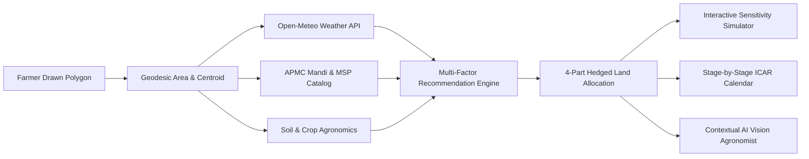
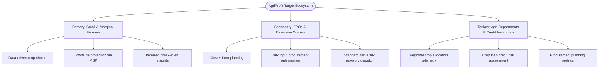
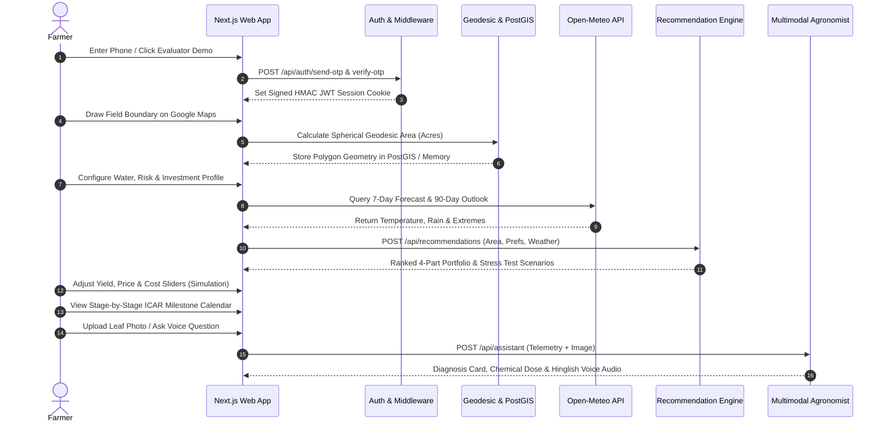
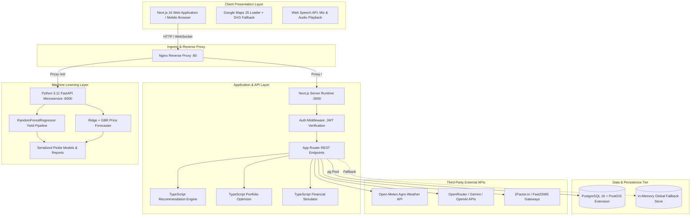
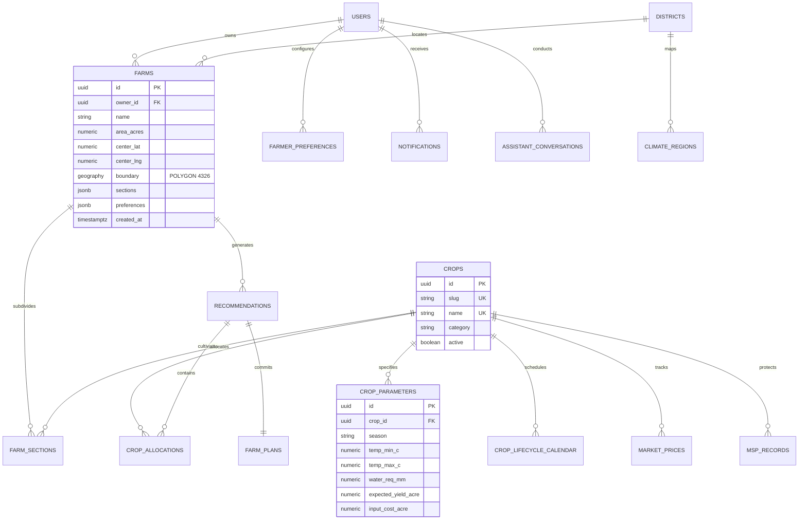
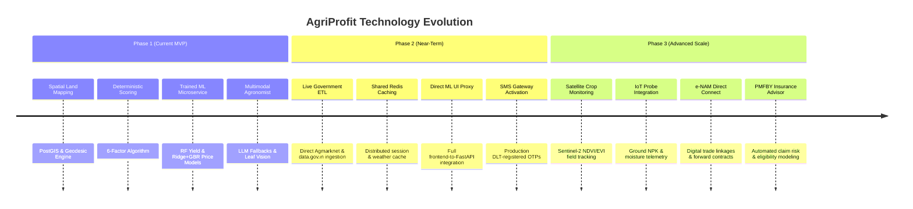
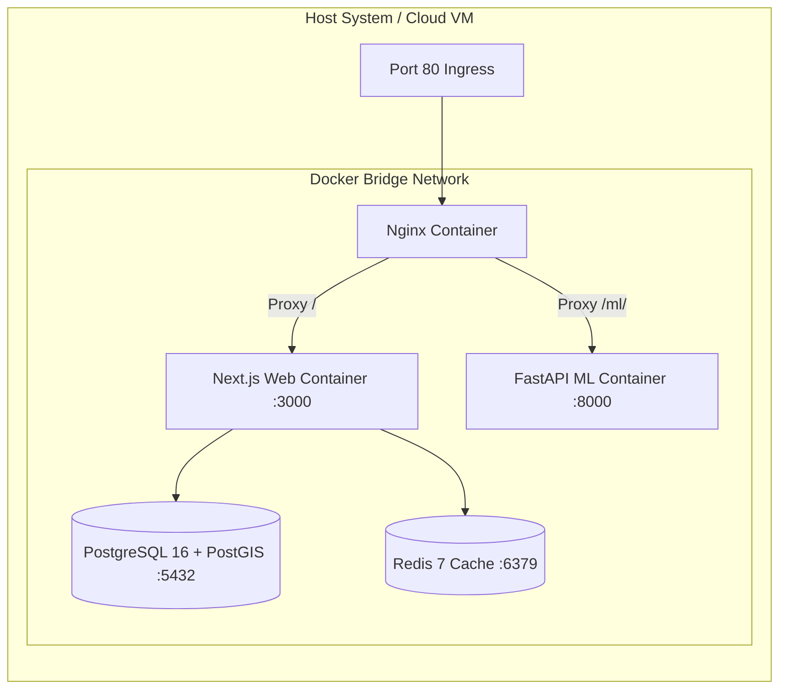

# AgriProfit — AI-Powered Smart Crop & Farm Profit Optimization Platform
## Comprehensive Technical Project Profile & Architectural Audit Report

---

### 1. Project Title

* **Full Project Name:** AgriProfit — AI-Powered Smart Crop & Farm Profit Optimization Platform
* **Repository Identifier:** `https://github.com/granth-alpha2/SIH2026.git`
* **Project Classification:** AgriTech / Geospatial Decision Support System (DSS) / Applied Machine Learning
* **Domain:** Precision Agriculture, Agricultural Economics, and Agro-Meteorological Intelligence
* **Problem Area:** Information asymmetry, price crash vulnerability, and mono-cropping financial risk among Indian farming households
* **Primary Target Users:** Smallholder, marginal, and commercial farmers across India; secondary adoption by Farmer Producer Organizations (FPOs) and agricultural extension officers
* **Primary Objective:** Deliver farm-specific, explainable, and risk-calibrated multi-crop portfolio allocations that maximize expected net profit, return on investment (ROI), and downside price protection by fusing spatial land boundaries, real-time agro-meteorology, APMC mandi price volatility, and Government Minimum Support Price (MSP) benchmarks.

---

### 2. Executive Summary

Indian agricultural decision-making remains heavily compromised by fragmented, retrospective, and localized advice. Farmers frequently select crops based on the prior season's peak prices, informal recommendations from village commission agents (*arhtiyas*), or neighbor imitation. This behavioral pattern systematically induces "cobweb cycles" of over-supply, post-harvest gluts, localized price collapses, and unhedged financial vulnerability.

**AgriProfit** is an open, modular agricultural decision-support platform designed to transform farm planning from intuition-driven guessing into an evidence-based, risk-hedged optimization workflow. Rather than evaluating farms as abstract regional averages, the platform anchors its entire analysis in **farmer-drawn field polygons** using spherical geodesic mathematics and spatial PostGIS indexing.

End-to-end, AgriProfit couples localized physical parameters with macroeconomic market signals:
1. **Spatial & Environmental Ingestion:** Centroid coordinates and exact field acreage (measured in acres and hectares) dynamically resolve the farmer's nearest district and agro-climatic zone, querying real-time 7-day agro-meteorology and 90-day precipitation baselines from Open-Meteo.
2. **Economic & Procurement Safety Net:** APMC mandi modal price series (Agmarknet/e-NAM benchmarks) are paired with official Commission for Agricultural Costs and Prices (CACP) Minimum Support Price (MSP) floors to quantify market volatility and downside protection.
3. **Dual-Layer Analytical Engine:** The platform applies a **deterministic, transparent 6-factor agronomic scoring algorithm** ($0\text{--}100$) alongside an **isolated Python FastAPI ML microservice** containing a Random Forest Crop Yield Regressor ($R^2 = 0.9601$ on test set) and an Ensemble Ridge + Gradient Boosting Mandi Price Forecaster ($R^2 = 0.9733, \text{MAPE} = 3.79\%$).
4. **4-Part Hedged Portfolio Allocation:** Rather than advising mono-culture planting, the system splits land parcels into four strategic allocations: **Part 1: Safety Floor (MSP-backed staple)**, **Part 2: Stability Cash Flow**, **Part 3: Profit Upside Capture**, and **Part 4: Soil Nitrogen Diversification**.
5. **Interactive Sensitivity Simulation & Agronomist Support:** Farmers can adjust interactive sliders (yield, market price, input cost) to evaluate financial break-even boundaries, view stage-by-stage ICAR milestone management calendars, and converse with a multimodal AI agronomist capable of computer vision leaf disease diagnosis.



**Implementation Honesty:** As audited, the repository contains fully functional TypeScript engines for scoring, portfolio optimization, and financial simulation, complete Next.js 16 frontend dashboards, verified PostGIS spatial schema migrations with in-memory fallbacks, trained Scikit-Learn model artifacts (`.pkl`), and verified live integrations with Open-Meteo and LLM providers. Certain production features—including live automated Kafka/ETL pipelines for daily Agmarknet scraping, Redis caching in application runtime, and direct API bridge calls from the frontend directly into the Python ML port—remain decoupled or configured in infrastructure without direct runtime consumption.

---

### 3. Problem Statement

Smallholder and marginal farmers in India—who operate more than 86% of total operational agricultural landholdings—face systemic structural hurdles that suppress farm-gate profitability:

1. **Information Asymmetry & Lagged Decisions:** Crop planting choices are commonly informed by the previous harvest’s clearing prices. If mustard or onion traded at high margins in the previous cycle, mass over-planting ensues, causing catastrophic market crashes at harvest.
2. **Disconnected Agro-Meteorology:** Weather data from district meteorological centers often fails to translate into actionable agronomic decisions. A farmer rarely knows whether forecasted rainfall matches the critical water requirements of a prospective crop's vegetative cycle.
3. **Mandi Price Volatility vs. MSP Safety Disconnect:** While the Indian Government fixes Minimum Support Prices for 22 mandated commodities, procurement infrastructure (FCI, NAFED, CCI) varies drastically by state and crop. Farmers lack tools that distinguish guaranteed-procurement crops from high-volatility free-market commodities.
4. **Escalating Input Cost Pressure:** Cultivation input costs—certified seeds, complex fertilizers (DAP, MOP, Urea), diesel for tube-wells, tractor hire, and migrant labor—have risen continuously. Without farm-specific break-even calculations ($₹/\text{quintal}$ and $\text{quintals}/\text{acre}$), farmers frequently invest in crops whose cost structures exceed realistic revenue potential.
5. **The Mono-Cropping Vulnerability Trap:** Allocating 100% of a land holding to a single cash crop leaves households vulnerable to localized pest outbreaks (e.g., Pink Bollworm in cotton or Yellow Rust in wheat) or sudden localized rain anomalies.
6. **The Decision Gap in Existing Tools:** Current digital agri-apps typically offer siloed features: one provides a weather forecast, another lists mandi rates as static tables, and a third gives generic cultivation tips. None synthetically compute: *"Given my exact 3.5 acres, medium borewell water access, balanced risk appetite, and local mandi prices, how much land should I allocate to which crops to maximize profit while securing my downside?"*

---

### 4. Proposed Solution

AgriProfit resolves this fragmentation by synthesizing spatial, environmental, agronomic, and market data into an integrated, interactive optimization pipeline:

* **Geospatial Parcel Grounding:** Farmers draw their actual farm boundary on an interactive map. The system calculates true geodesic surface area and extracts centroid coordinates, eliminating manual acreage data entry errors.
* **Agro-Climatic Zone Resolution:** Using centroid coordinates, the platform maps the field to the nearest of 28 validated Indian agricultural districts across 10 ICAR agro-climatic zones, extracting local soil typologies, average seasonal rainfall, and Köppen climate classifications.
* **Unified Macro-Micro Ingestion:** The recommendation engine ingests live 7-day hourly weather and 90-day precipitation baselines (Open-Meteo), benchmark APMC mandi prices and 30-day volatility indices, official CACP MSP floors, and itemized ICAR cost budgets (seed, fertilizer, irrigation, labor, machinery).
* **Multi-Crop Risk Hedging (The 4-Part Portfolio):** Instead of recommending an unhedged mono-culture, AgriProfit applies modern portfolio theory principles to agriculture. Land is divided into four functional quadrants:
  * *Safety Floor:* Guaranteed MSP crops to cover core input debts.
  * *Stability Cash Crop:* High water-efficiency, dependable local demand.
  * *Profit Opportunity:* High-margin vegetable/cash crops capturing market upside.
  * *Soil Diversity:* Leguminous pulse varieties that restore soil nitrogen and disrupt pest cycles.
* **Interactive Financial & Stress Simulation:** Farmers test scenarios directly via real-time mathematical simulators, adjusting price, yield, and cost variables to assess viability under drought, input inflation, or market slumps.
* **Lifecycle Guidance & Multimodal Advisory:** Following crop selection, the platform schedules stage-by-stage agronomic actions (irrigation timing, fertilizer top-dressing, weed management) and provides a multimodal AI agronomist capable of processing leaf photographs for pest and pathogen identification.

---

### 5. Project Objectives

The repository's codebase, schema, and test suites commit toward the following verified technical objectives:

* **Objective 1: Spatial Land Boundary Calculation:** Enable farmers to draw custom multi-point field polygons with real-time spherical geodesic area computation in both acres and hectares (`FarmMapPicker.tsx`, `geo-service.ts`).
* **Objective 2: Location-Specific Climatic Resolution:** Automatically resolve farm coordinates to the nearest Indian agro-climatic district and query live weather forecasts and extreme event alerts (`weather-service.ts`, `geo-service.ts`).
* **Objective 3: Deterministic Multi-Factor Agronomic Scoring:** Evaluate crop candidates through an open, explainable weighted scoring formula across weather suitability, market opportunity, gross margin, MSP safety, input cost fit, and soil compatibility (`recommendation-engine.ts`).
* **Objective 4: Constraint-Based Multi-Crop Allocation:** Dynamically partition farm acreage into a 4-part hedged portfolio based on user risk appetite (Conservative, Balanced, Growth), water availability, and investment budgets (`portfolio-optimizer.ts`).
* **Objective 5: Financial Sensitivity & Break-Even Modeling:** Calculate gross revenue, itemized cultivation costs, net profit, ROI multiplier, and break-even yields per crop and per farm (`simulation-engine.ts`).
* **Objective 6: Pre-Trained Machine Learning Inference:** Provide independent Python FastAPI microservices serving Scikit-Learn regression pipelines for crop yield prediction and forward mandi price forecasting (`ml-service/app/`).
* **Objective 7: Context-Aware Multimodal Agronomy Support:** Offer conversational agronomy assistance and computer vision leaf disease diagnosis using authorized field telemetry and LLM fallback routing (`ai-assistant-service.ts`).
* **Objective 8: Stage-by-Stage Agronomic Timeline Delivery:** Generate structured crop management calendars from land preparation to harvest based on sowing date and ICAR package-of-practices (`lifecycle-planner.ts`).

---

### 6. Target Users



#### Primary Users: Individual Smallholder and Marginal Farmers ($<2\text{ to }5\text{ Acres}$)
* **Concrete Benefit:** Eliminates guesswork and village rumor dependence; protects household capital through MSP-hedged allocations; computes exact break-even yields so farmers know their minimum viable market price; provides immediate disease diagnosis from mobile leaf photos.

#### Secondary Users: Farmer Producer Organizations (FPOs) & Agricultural Extension Workers
* **Concrete Benefit:** Enables FPO lead agronomists to model collective crop allocations across 50–500 member farms, streamlining bulk seed/fertilizer procurement, coordinating staggered sowing dates, and mitigating post-harvest local market gluts.

#### Tertiary Users: State Agricultural Departments, KVKs, and Rural Credit Institutions
* **Concrete Benefit:** Access to real-time administrative telemetry on regional crop distribution trends, irrigation demand density, and systemic risk exposure; banks and micro-lenders gain objective, farm-specific financial feasibility estimates for Kisan Credit Card (KCC) loan underwriting.

---

### 7. Key Features Matrix

Every feature below has been verified against actual files and functions in the repository:

| Feature | Description | Status | Evidence in Codebase |
|---|---|---|---|
| **Interactive Boundary Drawing** | Drawing multi-point land polygons on interactive maps with real-time vertex editing | ✅ Implemented | [FarmMapPicker.tsx](file:///c:/Users/hp/SIH2026/frontend/src/app/components/FarmMapPicker.tsx#L35-L120), `@googlemaps/js-api-loader` |
| **Geodesic Area Calculation** | Calculating area in acres and hectares using spherical polygon geodesics | ✅ Implemented | [FarmMapPicker.tsx](file:///c:/Users/hp/SIH2026/frontend/src/app/components/FarmMapPicker.tsx#L180-L215), `google.maps.geometry.spherical` with SVG fallback |
| **PostGIS Spatial Persistence** | Storing field geometries as `GEOGRAPHY(POLYGON, 4326)` with GiST spatial indexing | ✅ Implemented | [001_create_farms.sql](file:///c:/Users/hp/SIH2026/database/migrations/001_create_farms.sql#L1-L17), [repository.ts](file:///c:/Users/hp/SIH2026/frontend/src/app/api/farms/repository.ts#L41-L56) |
| **Nearest District Geocoding** | Haversine distance matching of lat/lng to nearest of 28 master agricultural districts | ✅ Implemented | [geo-service.ts](file:///c:/Users/hp/SIH2026/frontend/src/lib/geo-service.ts#L56-L95), `resolveDistrictFromCoords` |
| **Live Agro-Meteorology** | Fetching 7-day weather forecasts and temperature/rain metrics via Open-Meteo REST API | ✅ Implemented | [weather-service.ts](file:///c:/Users/hp/SIH2026/frontend/src/lib/weather-service.ts#L210-L270), `getAgriWeather` |
| **Extreme Weather Alerts** | Rule-based triggering of heatwave, frost, downpour, and drought advisories | ✅ Implemented | [weather-service.ts](file:///c:/Users/hp/SIH2026/frontend/src/lib/weather-service.ts#L95-L149), `evaluateExtremeAlerts` |
| **APMC Mandi Price Intelligence** | Daily modal prices, min/max spreads, 30-day price trends, and historical price charts | ✅ Implemented | [market-service.ts](file:///c:/Users/hp/SIH2026/frontend/src/lib/market-service.ts#L80-L240), `MANDI_BENCHMARK_PRICES` |
| **MSP Floor Benchmark Catalog** | Official CACP Minimum Support Prices, C2 cost estimates, and procurement agency linkages | ✅ Implemented | [market-service.ts](file:///c:/Users/hp/SIH2026/frontend/src/lib/market-service.ts#L83-L165), `OFFICIAL_MSP_CATALOG` |
| **Multi-Factor Scoring Engine** | 6-factor deterministic scoring formula ($0\text{--}100$) evaluating agronomic fit | ✅ Implemented | [recommendation-engine.ts](file:///c:/Users/hp/SIH2026/frontend/src/lib/recommendation-engine.ts#L224-L306), `generateRecommendations` |
| **4-Part Portfolio Optimizer** | Algorithmic land partitioning across Safety, Stability, Profit, and Diversity roles | ✅ Implemented | [portfolio-optimizer.ts](file:///c:/Users/hp/SIH2026/frontend/src/lib/portfolio-optimizer.ts#L180-L330), `optimizePortfolio` |
| **Financial & Break-Even Simulator** | Mathematical calculation of revenue, costs, net profit, ROI %, and break-even yields | ✅ Implemented | [simulation-engine.ts](file:///c:/Users/hp/SIH2026/frontend/src/lib/simulation-engine.ts#L36-L76), `simulateCropFinancials` |
| **7-Scenario Stress Testing** | Sensitivity analysis under monsoon deficit, drought, gluts, and input cost inflation | ✅ Implemented | [portfolio-optimizer.ts](file:///c:/Users/hp/SIH2026/frontend/src/lib/portfolio-optimizer.ts#L332-L420), `simulateScenarios` |
| **Pre-Trained Yield Regressor** | FastAPI endpoint serving RandomForestRegressor model artifact on ICAR data | ✅ Implemented | [yield_model.py](file:///c:/Users/hp/SIH2026/ml-service/app/models/yield_model.py#L22-L124), `ml-service/models_artifacts/yield_model.pkl` |
| **Pre-Trained Price Forecaster** | FastAPI endpoint serving Ridge + GBR ensemble forecaster on APMC time-series | ✅ Implemented | [price_model.py](file:///c:/Users/hp/SIH2026/ml-service/app/models/price_model.py#L26-L165), `ml-service/models_artifacts/price_model.pkl` |
| **Client-Side ML Integration** | Frontend UI components directly triggering Python FastAPI port 8000 endpoints | 🟡 Partially Implemented | Exists in typed SDK [api-client/src/index.ts](file:///c:/Users/hp/SIH2026/packages/api-client/src/index.ts#L86-L119), but frontend UI calls internal Next.js API routes |
| **Multimodal AI Agronomist Chat** | Context-aware agronomist chat with fallback across Gemini, OpenAI, OpenRouter | ✅ Implemented | [ai-assistant-service.ts](file:///c:/Users/hp/SIH2026/frontend/src/lib/ai-assistant-service.ts#L215-L350), `/api/assistant/route.ts` |
| **Computer Vision Leaf Pathology** | Photo upload with ICAR-calibrated diagnostic cards for plant disease and chemical dosages | ✅ Implemented | [ai-assistant-service.ts](file:///c:/Users/hp/SIH2026/frontend/src/lib/ai-assistant-service.ts#L115-L198), [assistant/page.tsx](file:///c:/Users/hp/SIH2026/frontend/src/app/assistant/page.tsx#L120-L240) |
| **Vernacular Voice Interaction** | Speech-to-text input (Hindi/English) and text-to-speech voice playback via Web Speech API | ✅ Implemented | [assistant/page.tsx](file:///c:/Users/hp/SIH2026/frontend/src/app/assistant/page.tsx#L170-L230), `SpeechRecognition` & `speechSynthesis` |
| **Crop Lifecycle Calendar** | Stage-by-stage agronomic management roadmap with days-after-sowing (DAS) tracking | ✅ Implemented | [lifecycle-planner.ts](file:///c:/Users/hp/SIH2026/frontend/src/lib/lifecycle-planner.ts#L110-L210), [crop-plan/page.tsx](file:///c:/Users/hp/SIH2026/frontend/src/app/crop-plan/page.tsx) |
| **Smart Advisory Notification Hub** | 5-category notification repository (Irrigation, Weather, Pest, Mandi, Stage) | ✅ Implemented | [notification-service.ts](file:///c:/Users/hp/SIH2026/frontend/src/lib/notification-service.ts#L35-L140), [repository.ts](file:///c:/Users/hp/SIH2026/frontend/src/app/api/notifications/repository.ts) |
| **Platform Telemetry & Admin Center**| Admin dashboard displaying API health checks, latencies, and data freshness matrix | ✅ Implemented | [admin-service.ts](file:///c:/Users/hp/SIH2026/frontend/src/lib/admin-service.ts#L47-L145), [admin/page.tsx](file:///c:/Users/hp/SIH2026/frontend/src/app/admin/page.tsx) |
| **OTP SMS Gateway** | Dispatching 6-digit OTPs via 2Factor.in and Fast2SMS HTTP REST gateways | 🟡 Partially Implemented | Client dispatch logic exists in [auth.ts](file:///c:/Users/hp/SIH2026/frontend/src/lib/auth.ts#L209-L265); falls back to simulated OTP in dev |
| **Redis Caching Tier** | In-memory session store and rate-limiting cache | 🔵 Configured but not integrated | Configured in `docker-compose.yml` and `.env.example`; no Redis driver in `package.json` |
| **Satellite NDVI Vegetation Tracking**| High-resolution Sentinel-2 satellite imagery ingestion for field vigor monitoring | 🟣 Planned / Future | Outlined in roadmap docs only; no satellite pipeline in code |
| **IoT Ground Sensor Telemetry** | Soil probe integration for real-time NPK, moisture, and EC data ingestion | 🟣 Planned / Future | Documented in architecture roadmap; zero code implementation |

---

### 8. End-to-End Farmer Workflow

The diagram below details the 10-stage farmer journey, explicitly distinguishing code-backed paths from conceptual abstractions:



#### Step-by-Step Reality Audit:

1. **Authentication & Session Issuance:**
   * *Code Reality:* Implemented in [auth.ts](file:///c:/Users/hp/SIH2026/frontend/src/lib/auth.ts) and protected by [middleware.ts](file:///c:/Users/hp/SIH2026/frontend/src/middleware.ts). Users authenticate via 10-digit Indian mobile number. In development, a bypass button ("Instant Evaluator Demo") signs an HMAC-SHA256 JWT cookie without third-party SMS delays.
2. **Interactive Farm Mapping:**
   * *Code Reality:* Implemented in [FarmMapPicker.tsx](file:///c:/Users/hp/SIH2026/frontend/src/app/components/FarmMapPicker.tsx). Uses Google Maps JavaScript API with a custom drawing listener. If the Google Maps API key is omitted, an interactive HTML5/SVG canvas renders dynamically, permitting boundary drawing and geodesic area calculation without crashing.
3. **Centroid Geocoding & District Resolution:**
   * *Code Reality:* Implemented in [geo-service.ts](file:///c:/Users/hp/SIH2026/frontend/src/lib/geo-service.ts). The centroid coordinates calculated from the polygon vertices are matched via the Haversine formula against `DISTRICT_MASTER` to extract district name, state, and ICAR agro-climatic zone.
4. **Preference Calibration:**
   * *Code Reality:* Implemented in [preferences/page.tsx](file:///c:/Users/hp/SIH2026/frontend/src/app/preferences/page.tsx). Farmers select risk tolerance (Conservative, Balanced, Growth), water source (Rainfed, Canal, Borewell, Drip), investment capital, and avoided crops.
5. **Agro-Meteorological Ingestion:**
   * *Code Reality:* Implemented in [weather-service.ts](file:///c:/Users/hp/SIH2026/frontend/src/lib/weather-service.ts). Live HTTP queries fetch 7-day hourly temperature, precipitation probability, humidity, and WMO codes from Open-Meteo with an in-memory 1-hour cache and regional baseline fallback.
6. **Multi-Crop Scoring & Ranking:**
   * *Code Reality:* Implemented in [recommendation-engine.ts](file:///c:/Users/hp/SIH2026/frontend/src/lib/recommendation-engine.ts). Candidate crops for the active season (Kharif, Rabi, Zaid) are evaluated against 6 weighted agronomic criteria, penalizing avoided crops and extreme water mismatches.
7. **4-Part Portfolio Partitioning:**
   * *Code Reality:* Implemented in [portfolio-optimizer.ts](file:///c:/Users/hp/SIH2026/frontend/src/lib/portfolio-optimizer.ts). The farm's total acreage is allocated into Safety Floor, Stability Cash Crop, Profit Opportunity, and Soil Legume quadrants.
8. **Financial Sensitivity & Break-Even Simulation:**
   * *Code Reality:* Implemented in [simulation-engine.ts](file:///c:/Users/hp/SIH2026/frontend/src/lib/simulation-engine.ts) and rendered in [RecommendationDashboard.tsx](file:///c:/Users/hp/SIH2026/frontend/src/app/recommendations/RecommendationDashboard.tsx). Real-time mathematical recalculation displays updated revenues and break-even points as users adjust sliders.
9. **Lifecycle Calendar Tracking:**
   * *Code Reality:* Implemented in [lifecycle-planner.ts](file:///c:/Users/hp/SIH2026/frontend/src/lib/lifecycle-planner.ts). Blueprints calculate sowing-to-harvest milestones, identifying the active stage based on days-after-sowing (DAS).
10. **Multimodal Advisory & Disease Diagnosis:**
    * *Code Reality:* Implemented in [ai-assistant-service.ts](file:///c:/Users/hp/SIH2026/frontend/src/lib/ai-assistant-service.ts). Injects live farm context (crop, DAS, weather, mandi rate) into LLM prompts (Gemini/OpenRouter/OpenAI). For leaf images, it generates diagnostic disease cards and chemical spray treatments.

---

### 9. System Architecture

The platform follows a modular, distributed service topology:



* **Frontend Layer:** Built on Next.js 16 (App Router), React 19, TypeScript 5, and Tailwind CSS v4. Features client components for interactive maps, SVG donut chart visualizations, real-time sliders, and Web Speech API synthesis.
* **Backend Layer:** Implemented as native Next.js server route handlers (`/api/farms`, `/api/recommendations`, `/api/weather`, etc.) leveraging edge-compatible Web Crypto HMAC signing for JWT verification.
* **Database Layer:** PostgreSQL 16 with the PostGIS extension. Manages spatial `GEOGRAPHY(POLYGON, 4326)` geometries, GiST spatial indexing, and normalized relational entities (`users`, `farms`, `crop_parameters`, `market_prices`, `msp_records`). A graceful in-memory storage layer activates if `DATABASE_URL` is unset.
* **Caching Layer:** Redis 7 is defined in `docker-compose.yml` and `docker-compose.prod.yml`. Application code uses an in-memory `Map` cache with a 1-hour TTL for meteorological data.
* **Machine Learning Microservice:** Python 3.11+ / FastAPI service exposing `/predict/yield`, `/forecast/price`, and `/health` endpoints. Operates independently from the Next.js process.

---

### 10. Technology Stack

A comprehensive audit of all technologies identified across package manifests, configuration files, and source code:

| Layer | Technology | Purpose | Actual Usage |
|---|---|---|---|
| **Frontend Framework** | Next.js 16.3.2 | App Router full-stack web framework | Used |
| **UI Library** | React 19.2.8 | Declarative reactive user interface | Used |
| **Language** | TypeScript 5.x | End-to-end type safety and domain modeling | Used |
| **Styling** | Tailwind CSS v4 | Responsive, mobile-first utility styling | Used |
| **Map Loader** | `@googlemaps/js-api-loader` 2.1.1 | Dynamic Google Maps JS API script injection | Used |
| **Map Fallback** | HTML5 / SVG Canvas | Zero-dependency spatial polygon drawing | Used |
| **Database Driver** | `pg` 8.23.0 & `@types/pg` | Raw PostgreSQL client pooling | Used |
| **Database Engine** | PostgreSQL 16 | Relational persistence store | Used |
| **Spatial Extension**| PostGIS 3.4 (`postgis/postgis:16-3.4-alpine`) | Spherical geometry storage & spatial queries | Used |
| **Cache Store** | Redis 7 (`redis:7-alpine`) | Containerized session & telemetry cache | Configured |
| **In-Memory Cache**| Node.js / TypeScript `Map` | 1-Hour TTL meteorological report caching | Used |
| **ML Framework** | Python 3.11+ | Scientific computing runtime | Used |
| **ML Web Server** | FastAPI 0.110.0 + Uvicorn 0.28.0 | High-performance ASGI microservice | Used |
| **ML Data Models** | Pydantic 2.6.0 | Payload validation and schema enforcement | Used |
| **Data Science** | Pandas 2.2.0 & NumPy 1.26.0 | Tabular data manipulation and matrix algebra | Used |
| **Machine Learning**| Scikit-Learn 1.4.0 | Random Forest & Ensemble regression models | Used |
| **Model Serialization**| Joblib 1.3.2 / Pickle | Deserializing trained `.pkl` pipeline artifacts | Used |
| **Reverse Proxy** | Nginx (`nginx:alpine`) | Port 80 ingress routing to Next.js and FastAPI | Used |
| **Containerization**| Docker & Docker Compose v3.8 | Multi-service local and production orchestration | Used |
| **CI/CD** | GitHub Actions (`ci.yml`, `ml-validation.yml`) | Automated typechecking, tests, and ML validation | Used |
| **Weather API** | Open-Meteo REST API | Live hourly weather & precipitation queries | Used |
| **LLM Provider** | Google Gemini API (`gemini-2.0-flash`) | Direct multimodal conversational agronomy | Used |
| **LLM Provider** | OpenRouter API (`openrouter.ai/api/v1`) | Multi-model fallback LLM routing | Used |
| **LLM Provider** | OpenAI API (`api.openai.com/v1`) | Fallback chat completion endpoint | Used |
| **SMS Gateway** | 2Factor.in REST API | Pure text SMS OTP mobile delivery | Configured |
| **SMS Gateway** | Fast2SMS Bulk V2 REST API | Backup OTP dispatch gateway | Configured |
| **Audio/Voice API** | HTML5 Web Speech API | Vernacular speech-to-text & text-to-speech | Used |

---

### 11. AI / Machine Learning Architecture

The AgriProfit AI ecosystem is structured into three distinct tiers:

```mermaid
graph TB
    subgraph Tier1 [Tier 1: Deterministic Agronomic Engine]
        Rules[Weighted 6-Factor Algorithm]
        Explainer[Dynamic Linguistic Explainability]
    end

    subgraph Tier2 [Tier 2: Trained Machine Learning Microservice]
        YieldModel[RandomForestRegressor v2.0<br/>7,000 ICAR Rows | Test R²: 0.9601]
        PriceModel[Ridge + GBR Ensemble v2.0<br/>19,500 APMC Rows | Test R²: 0.9733]
    end

    subgraph Tier3 [Tier 3: Context-Aware Multimodal AI Agronomist]
        Context[Farm Geometry, DAS, Weather, Mandi Context]
        LLMs[OpenRouter / Gemini / OpenAI Fallback]
        Vision[ICAR Calibrated Leaf Pathology Diagnostics]
    end

    Tier1 --> Explainer
    Tier2 --> YieldModel
    Tier2 --> PriceModel
    Tier3 --> Context
    Context --> LLMs
    LLMs --> Vision
```

#### Tier 1: Deterministic Weighted Agronomic Scoring (Runtime Core)
* **Design Philosophy:** Transparency and explainability. Rather than passing farm parameters into an opaque black-box neural network, the live Next.js application executes an audited 6-factor deterministic scoring algorithm. This guarantees that every crop recommendation can be explained to a farmer with clear causal factors.

#### Tier 2: Trained Python Machine Learning Microservice (`ml-service/`)
Located in `ml-service/`, this independent FastAPI service exposes pre-trained machine learning pipelines:

1. **Crop Yield Prediction Pipeline (`YieldPredictionModel`):**
   * **Algorithm:** `RandomForestRegressor(n_estimators=100, max_depth=12)`
   * **Dataset:** 7,000 rows derived from ICAR agro-climatic yield trials (Train: 4,900, Val: 1,400, Test: 700).
   * **Input Features:** `avg_temp_c`, `total_rainfall_mm`, `soil_ph`, `nitrogen_kg_per_ha`, `crop_name_enc`, `state_enc`, `irrigation_type_enc`.
   * **Target:** `actual_yield_kg_per_ha`.
   * **Benchmarked Metrics (From `yield_report.json`):**
     * Train $R^2: 0.9840$ | Train MAE: $428.2\text{ kg/ha}$
     * Validation $R^2: 0.9451$ | Validation MAE: $690.8\text{ kg/ha}$
     * **Test $R^2: 0.9601$ | Test MAE: $683.3\text{ kg/ha}$ | Test RMSE: $1309.4\text{ kg/ha}$**
   * **Feature Importance:** `crop_name_enc` ($61.8\%$), `avg_temp_c` ($32.1\%$), `total_rainfall_mm` ($3.4\%$), `irrigation_type_enc` ($1.6\%$).

2. **APMC Mandi Price Forecaster (`PriceForecaster`):**
   * **Algorithm:** Weighted Ensemble combining `Ridge(alpha=1.0)` ($50\%$) and `GradientBoostingRegressor(n_estimators=200, max_depth=5)` ($50\%$).
   * **Dataset:** 19,500 daily and monthly mandi arrival records (Train: 9,900, Val: 3,600, Test: 6,000).
   * **Input Features:** `price_lag1_inr`, `price_lag2_inr`, `price_lag3_inr`, `rainfall_anomaly_mm`, `trade_demand_index`, `month_sin`, `month_cos`, `price_momentum`, `log_lag1`, `log_lag2`, `log_lag3`, `crop_name_enc`, `state_enc`.
   * **Target:** `target_price_next_period_inr`.
   * **Benchmarked Metrics (From `price_report.json`):**
     * Train $R^2: 0.9769$ | Train MAPE: $3.59\%$
     * Validation $R^2: 0.9721$ | Validation MAPE: $3.91\%$
     * **Test $R^2: 0.9733$ | Test MAPE: $3.79\%$ | Test MAE: $₹167.63/\text{quintal}$ | Test RMSE: $₹219.36/\text{quintal}$**
   * **Feature Importance (GBR):** `price_lag1_inr` ($51.7\%$), `log_lag1` ($33.4\%$), `log_lag2` ($6.0\%$), `price_lag2_inr` ($4.8\%$).

#### Tier 3: Multimodal Context-Aware AI Agronomist (`ai-assistant-service.ts`)
* Injects real-time authorized field telemetry (crop variety, days after sowing, live weather forecast, and mandi rates) into the LLM system prompt.
* Features automatic failover between Gemini (`gemini-2.0-flash`), OpenRouter free reasoning models (`gemini-2.0-flash-exp:free`, `llama-3.3-70b-instruct:free`), and OpenAI (`gpt-4o-mini`).
* Strips chain-of-thought `<think>...</think>` tokens before returning clean advice to the user.
* Diagnoses uploaded leaf photos and matches visual symptoms against an ICAR disease database to output structured diagnostic cards with chemical dosages and organic remedies.

#### Future ML Ambitions (Explicitly Not Yet Deployed)
* Satellite imagery computer vision (Sentinel-2 NDVI/EVI vegetative indices).
* Graph Neural Networks (GNNs) for inter-mandi spatial price arbitrage.
* Deep Reinforcement Learning for dynamic multi-year crop rotation sequencing.

---

### 12. Recommendation / Scoring Engine

The core recommendation logic executed in [recommendation-engine.ts](file:///c:/Users/hp/SIH2026/frontend/src/lib/recommendation-engine.ts) evaluates every candidate crop using the exact mathematical formulation reproduced below.

#### Composite Scoring Formulation

$$\text{Score}_{\text{crop}} = \min\Big(98, \; \max\big(15, \; \text{round}\big(S_{\text{raw}}\big)\big)\Big)$$

Where the raw composite score $S_{\text{raw}}$ is defined as:

$$S_{\text{raw}} = 0.25 \, S_{\text{weather}} + 0.20 \, S_{\text{market}} + 0.20 \, S_{\text{profit}} + 0.15 \, S_{\text{msp}} + 0.10 \, S_{\text{cost}} + 0.10 \, S_{\text{soil}} - P_{\text{risk}}$$

#### Factor Score Formulations

1. **Weather Suitability Score ($S_{\text{weather}} \in [10, 100]$):**
   $$S_{\text{weather}} = \text{clamp}_{[10, 100]}\Big(75 + \Delta_{\text{temp}} + \Delta_{\text{water}}\Big)$$
   * $\Delta_{\text{temp}} = +15$ if $T_{\text{curr}} \in [T_{\text{ideal\_min}}, T_{\text{ideal\_max}}]$; $+5$ if $T_{\text{curr}} \in [T_{\text{min}}, T_{\text{max}}]$; $-20$ otherwise.
   * $\Delta_{\text{water}} = -35$ if $\text{CropWater} = \text{High} \land \text{FarmerWater} = \text{Low}$; $+15$ if both are $\text{Low}$; $+10$ if both are $\text{High}$; $0$ otherwise.

2. **Market Opportunity Score ($S_{\text{market}} \in [15, 100]$):**
   $$S_{\text{market}} = \text{clamp}_{[15, 100]}\Big(60 + \Delta_{\text{trend}} + \Delta_{\text{volatility}} + \Delta_{\text{benchmark}}\Big)$$
   * $\Delta_{\text{trend}} = +20$ if $\text{Trend}_{30\text{d}} > +5\%$; $+10$ if $\text{Trend}_{30\text{d}} > 0\%$; $-15$ if $\text{Trend}_{30\text{d}} < -5\%$.
   * $\Delta_{\text{volatility}} = +10$ if $\text{Volatility} = \text{Low}$; $-10$ if $\text{Volatility} = \text{High}$.
   * $\Delta_{\text{benchmark}} = +10$ if $P_{\text{modal}} \ge P_{\text{typical}}$; $0$ otherwise.

3. **Profitability Score ($S_{\text{profit}} \in [20, 100]$):**
   $$S_{\text{profit}} = \text{clamp}_{[20, 100]}\Big(50 + \Delta_{\text{ROI}} + \Delta_{\text{margin}}\Big)$$
   * $\Delta_{\text{ROI}} = +30$ if $\text{ROI} \ge 3.0$; $+20$ if $\text{ROI} \ge 2.0$; $+10$ if $\text{ROI} \ge 1.5$.
   * $\Delta_{\text{margin}} = +20$ if $\text{Profit}_{\text{acre}} > ₹50,000$; $+10$ if $\text{Profit}_{\text{acre}} > ₹25,000$.

4. **MSP / Procurement Safety Score ($S_{\text{msp}} \in [40, 95]$):**
   $$S_{\text{msp}} = \begin{cases} 95, & \text{if crop is MSP eligible and has fixed benchmark} \\ 40, & \text{if exposed entirely to free-market price swings} \end{cases}$$

5. **Cost Fit Score ($S_{\text{cost}} \in [35, 95]$):**
   Calibrated to the farmer's working capital capacity:
   * *Low Capacity:* $95$ if $C_{\text{acre}} < ₹10,000$; $70$ if $C_{\text{acre}} < ₹20,000$; $35$ if $C_{\text{acre}} \ge ₹20,000$.
   * *Medium Capacity:* $90$ if $C_{\text{acre}} < ₹25,000$; $65$ otherwise.
   * *High Capacity:* $90$ across all crops.

6. **Soil Compatibility Score ($S_{\text{soil}} \in [80, 100]$):**
   $$S_{\text{soil}} = \min\big(100, \; 80 + \Delta_{\text{soil\_type}} + \Delta_{\text{pH}}\big)$$
   * $\Delta_{\text{soil\_type}} = +15$ if farmer's soil matches crop's agronomic profile.
   * $\Delta_{\text{pH}} = +5$ if soil pH $\in [6.5, 7.8]$.

7. **Risk Penalty ($P_{\text{risk}}$):**
   $$P_{\text{risk}} = \begin{cases} +50, & \text{if crop is explicitly listed in farmer's avoided crops} \\ -10, & \text{if crop is explicitly listed in farmer's preferred crops} \\ 0, & \text{otherwise} \end{cases}$$

#### Deterministic Financial Simulation Formulas

Executed in [simulation-engine.ts](file:///c:/Users/hp/SIH2026/frontend/src/lib/simulation-engine.ts):

$$\text{Gross Revenue} = \text{Area (acres)} \times \text{Yield (quintals/acre)} \times \text{Price (₹/quintal)}$$

$$\text{Total Cost} = \text{Area (acres)} \times \text{Cost per Acre (₹)}$$

$$\text{Net Profit} = \text{Gross Revenue} - \text{Total Cost}$$

$$\text{ROI Multiplier} = \frac{\text{Gross Revenue}}{\text{Total Cost}}, \quad \text{ROI \%} = \left(\frac{\text{Net Profit}}{\text{Total Cost}}\right) \times 100$$

$$\text{Break-Even Price} = \frac{\text{Cost per Acre}}{\text{Yield per Acre}}, \quad \text{Break-Even Yield} = \frac{\text{Cost per Acre}}{\text{Selling Price per Quintal}}$$

---

### 13. Data Sources and Datasets

The repository maintains an audited data package under `data/` and `datasets/`:

| Dataset File | Source / Provenance | Purpose | Format | Used By | Status |
|---|---|---|---|---|---|
| `reference/01_states_districts.csv` | Survey of India / Census / ICAR | 28 master districts across 10 agro-climatic zones | CSV (28 rows) | `geo-service.ts`, `init.sql` | ✅ Active Seed |
| `reference/02_climate_regions.csv` | Köppen Climate System / IMD | Regional climate classification per district | CSV (28 rows) | `init.sql`, DB Seeds | ✅ Active Seed |
| `reference/03_crops_master.csv` | ICAR Package of Practices / CACP | 25+ crops with water, temp, duration & input costs | CSV (25 rows) | `crop-data.ts`, `init.sql` | ✅ Active Seed |
| `reference/04_crop_lifecycle_calendar.csv` | ICAR Agronomic Extension Guides | 5-stage agronomic milestones per crop with guidance | CSV (125 rows) | `lifecycle-planner.ts` | ✅ Active Seed |
| `raw/01_farmers.csv` | Synthetic Algorithmic Generator | Simulated historical farmer profiles | CSV (1,000 rows)| `init.sql` | 🟡 Benchmark Seed |
| `raw/02_farms.csv` | Synthetic Algorithmic Generator | Land parcel attributes and acreages | CSV (1,200 rows)| `init.sql` | 🟡 Benchmark Seed |
| `raw/03_farms.geojson` | Synthetic GIS Boundary Builder | Geospatial Polygon feature collections | GeoJSON | Spatial tests, DB Seeds | 🟡 Benchmark Seed |
| `raw/04_land_sections.csv` | Synthetic Algorithmic Generator | Sub-divided plot irrigation and soil properties | CSV (2,400 rows)| `init.sql` | 🟡 Benchmark Seed |
| `raw/05_weather_climate_daily.csv` | IMD Meteorological Archive Baseline | 2-year daily historical meteorological observations | CSV (20,440 rows)| ML Training | ✅ ML Training |
| `raw/06_mandi_prices.csv` | Agmarknet / e-NAM Historical Feeds | Daily APMC arrivals, min, max, and modal prices | CSV (19,500 rows)| ML Price Model | ✅ ML Training |
| `raw/07_msp_data.csv` | DA&FW / CACP Gazette Releases | Official Government MSP benchmarks (2020–2025) | CSV (110 rows) | `market-service.ts` | ✅ Active Seed |
| `raw/08_trade_data.csv` | FAOSTAT / UN Comtrade Indices | Export/import demand indices per commodity | CSV (300 rows) | ML Price Features | ✅ ML Training |
| `raw/09_soil_health.csv` | Soil Health Card Portal Baseline | Soil NPK, pH, and micronutrient profiles | CSV (560 rows) | ML Yield Features | ✅ ML Training |
| `raw/10_notifications.csv` | Agronomic Advisory Rules | Historical alert dispatch seed records | CSV (250 rows) | `notifications` table | 🟡 Benchmark Seed |
| `processed/01_mandi_prices_clean.csv`| Feature Engineering Pipeline | Outlier-filtered price series with 30/60/90d lags | CSV (19,500 rows)| ML Price Model | ✅ ML Training |
| `processed/02_weather_features_seasonal.csv` | Feature Engineering Pipeline | 90-day rolling precipitation & GDD sums | CSV (20,440 rows)| ML Yield Model | ✅ ML Training |

> [!NOTE]
> **Data Grounding Note:** As explicitly recorded in `datasets/metadata/DATA_DICTIONARY.md`, all row-level transactional records are **synthetic seed data** algorithmically generated to match realistic Indian agricultural parameters and maintain referential integrity. Master agronomic benchmarks (costs, temperatures, water needs, MSPs) reflect official ICAR and CACP 2024–25 publications.

---

### 14. Database Design

The PostgreSQL/PostGIS database design is defined across [init.sql](file:///c:/Users/hp/SIH2026/database/init.sql) and transactional migrations:



#### Key Architectural Highlights:
* **Spatial Polygon Storage:** `farms.boundary` is defined as `GEOGRAPHY(POLYGON, 4326)`. Spatial indexing is implemented via `CREATE INDEX farms_boundary_gist_idx ON farms USING GIST(boundary);`.
* **Idempotent Migration Pipeline:**
  * `001_create_farms.sql`: Enables PostGIS extension; builds baseline `farms` spatial table.
  * `002_mvp_schema.sql`: Extends schema with `pgcrypto`, `users`, normalized `crops`, `crop_parameters`, `farm_sections`, `farmer_preferences`, `market_prices`, and `recommendations`.
  * `003_create_notifications.sql`: Creates `notifications` table with read status and timestamp indexes.
* **In-Memory Graceful Degradation:** To support zero-dependency hackathon evaluation without requiring a running PostgreSQL instance, `repository.ts` inspects `process.env.DATABASE_URL`. If unset, queries transparently route to an in-memory `globalThis` store.

---

### 15. API Architecture

#### Discovered Next.js Backend Endpoints (`frontend/src/app/api/`):

| Endpoint | Method | Purpose | Input Payload | Output Format | Status |
|---|---|---|---|---|---|
| `/api/auth/send-otp` | `POST` | Dispatches 6-digit OTP to mobile | `{ phone: string }` | `{ success: boolean, message: string }` | ✅ Implemented |
| `/api/auth/verify-otp` | `POST` | Validates OTP and issues JWT cookie | `{ phone: string, otp: string }` | `{ success: boolean, user: object }` | ✅ Implemented |
| `/api/auth/me` | `GET` | Returns authenticated user session | Session Cookie | `{ authenticated: boolean, user: object }`| ✅ Implemented |
| `/api/auth/logout` | `POST` | Clears authentication session cookie | None | `{ success: boolean }` | ✅ Implemented |
| `/api/farms` | `GET` | Lists all registered spatial farms | None | `{ success: boolean, farms: FarmRecord[] }`| ✅ Implemented |
| `/api/farms` | `POST` | Creates new farm polygon in PostGIS | `{ name, areaAcres, center, boundary }` | `{ success: boolean, farm: FarmRecord }` | ✅ Implemented |
| `/api/farms/[id]` | `GET` | Retrieves single farm boundary | Route Parameter `id` | `{ success: boolean, farm: FarmRecord }` | ✅ Implemented |
| `/api/farms/[id]` | `PUT` | Updates farm boundaries and sections | `{ name, areaAcres, boundary, sections }` | `{ success: boolean, farm: FarmRecord }` | ✅ Implemented |
| `/api/farms/[id]` | `DELETE` | Removes farm record from store | Route Parameter `id` | `{ success: boolean }` | ✅ Implemented |
| `/api/preferences` | `GET` | Retrieves farmer risk/water preferences | Session Cookie | `{ success: boolean, preferences: object }`| ✅ Implemented |
| `/api/preferences` | `POST` | Updates farmer preferences | `{ riskAppetite, waterAvailability, ... }` | `{ success: boolean, preferences: object }`| ✅ Implemented |
| `/api/recommendations` | `POST` | Generates ranked 4-part portfolio | `{ farmId?, farmAreaAcres?, preferences? }` | `{ success: boolean, recommendation: object }` | ✅ Implemented |
| `/api/weather` | `GET` | 7-day forecast & seasonal outlook | Query params `lat`, `lng`, `locationName` | `{ success: boolean, weather: object }` | ✅ Implemented |
| `/api/markets` | `GET` | Daily APMC mandi prices and trends | Query params `crop`, `state` | `{ success: boolean, markets: MandiRecord[] }`| ✅ Implemented |
| `/api/markets/[cropSlug]`| `GET`| Historical 6-month mandi price series | Route Parameter `cropSlug` | `{ success: boolean, market: object }` | ✅ Implemented |
| `/api/msp` | `GET` | Official CACP Minimum Support Prices | Query params `season`, `category` | `{ success: boolean, mspRecords: object[] }`| ✅ Implemented |
| `/api/crops` | `GET` | Agronomic catalog of 25+ crops | Query params `season`, `category` | `{ success: boolean, crops: CropRecord[] }`| ✅ Implemented |
| `/api/crops/[id]` | `GET` | Single crop agronomic parameters | Route Parameter `id` | `{ success: boolean, crop: CropRecord }` | ✅ Implemented |
| `/api/notifications` | `GET` | Retrieves advisory notification inbox | Session Cookie | `{ notifications: object[], unreadCount }` | ✅ Implemented |
| `/api/notifications/mark-read` | `POST` | Marks notifications as read | `{ id?: string, all?: boolean }` | `{ success: boolean }` | ✅ Implemented |
| `/api/assistant` | `GET` | Ingests active farm context telemetry | Session Cookie | `{ context: FarmerContext }` | ✅ Implemented |
| `/api/assistant` | `POST` | Agronomist chat & leaf diagnosis | `{ message: string, image?: string }` | `{ message: object, contextSnapshot }` | ✅ Implemented |
| `/api/admin/metrics` | `GET` | System health and data quality matrix | Session Cookie (Admin) | `{ success: boolean, metrics: object }` | ✅ Implemented |
| `/api/health` | `GET` | Service readiness probe | None | `{ status: "ok", timestamp: string }` | ✅ Implemented |

#### Python FastAPI Microservice Endpoints (`ml-service/app/main.py`):

| Endpoint | Method | Purpose | Input Payload | Output Format | Status |
|---|---|---|---|---|---|
| `http://127.0.0.1:8000/` | `GET` | Service index and documentation links | None | `{ service: string, status: "ONLINE" }` | ✅ Implemented |
| `http://127.0.0.1:8000/health` | `GET` | Model loaded state & benchmark metrics | None | `{ status: "healthy", models: object }` | ✅ Implemented |
| `http://127.0.0.1:8000/predict/yield` | `POST` | Random Forest crop yield prediction | `{ crop_slug, rainfall_mm, soil_ph, ... }` | `{ predicted_yield_q_per_acre, ci, ... }`| ✅ Implemented |
| `http://127.0.0.1:8000/forecast/price`| `POST` | Ensemble Ridge+GBR price forecasting | `{ crop_slug, current_price_inr, ... }` | `{ forecasted_price_inr_per_quintal, ... }`| ✅ Implemented |

---

### 16. Frontend Architecture

The user interface is structured around a responsive dashboard shell ([AppShell.tsx](file:///c:/Users/hp/SIH2026/frontend/src/app/components/AppShell.tsx)):

* **Application Shell & Navigation:** Side navigation providing persistent routing across Command Center (`/`), Farm Mapping (`/farms`), Strategy Recommendations (`/recommendations`), Weather Intelligence (`/weather`), Mandi Markets (`/markets`), Crop Discovery (`/crops`), Agronomist AI (`/assistant`), Lifecycle Plan (`/crop-plan`), and System Telemetry (`/admin`).
* **Spatial Map Interface (`FarmMapPicker.tsx`):**
  * Integrated with Google Maps JavaScript API via `@googlemaps/js-api-loader`.
  * Allows farmers to draw multi-point land polygons, drag centroid markers, and geolocate using the browser's "📍 Use My Location" GPS functionality.
  * Features a custom zero-dependency SVG drawing canvas fallback when third-party map tiles are unavailable.
* **Strategic Recommendation Dashboard (`RecommendationDashboard.tsx`):**
  * Implements dynamic SVG Donut Charts mapping percentage land allocation across the 4-part portfolio.
  * Displays itemized revenue, cost, profit, and ROI cards per crop.
  * Provides expandable explainability cards showing exact agronomic rationale and data lineage.
* **Interactive Financial Sensitivity Simulator:**
  * Embedded directly in the recommendation view.
  * Sliders allow farmers to test adjustments to land area, anticipated market prices, expected yields, and input costs, recalculating net return and break-even points in real time.
* **Context-Aware Multimodal Agronomist Chat (`assistant/page.tsx`):**
  * Split-screen interface with active farm telemetry sidebar (current crop, DAS, local weather, mandi rates).
  * Web Speech API integration for vernacular speech-to-text voice input and audio response playback.
  * Leaf photo attachment with sample disease scan presets (Wheat Yellow Rust, Potato Late Blight, Nitrogen Chlorosis).
* **State Management & Communication:**
  * Uses React hooks (`useState`, `useEffect`, `useMemo`, `useCallback`) without heavy third-party state libraries like Redux.
  * Server synchronization via standard browser `fetch()` calling internal Next.js REST API routes.
* **Theming & Design Tokens:**
  * Custom CSS variables defined in [globals.css](file:///c:/Users/hp/SIH2026/frontend/src/app/globals.css) and [shell.css](file:///c:/Users/hp/SIH2026/frontend/src/app/shell.css).
  * Comprehensive light/dark mode support with persistent state via [ThemeToggle.tsx](file:///c:/Users/hp/SIH2026/frontend/src/app/components/ThemeToggle.tsx).

---

### 17. Security Architecture

1. **Authentication & Session Tokens:**
   * Uses JSON Web Tokens (JWT) signed via HMAC-SHA256 (`HS256`) using the standard Web Crypto API (`crypto.subtle`).
   * Tokens are stored in secure HTTP-only cookies (`agriprofit_session`) with `SameSite=Lax` protection, preventing client-side JavaScript access and mitigating cross-site scripting (XSS) risks.
2. **Server-Side Route Protection:**
   * Handled through [middleware.ts](file:///c:/Users/hp/SIH2026/frontend/src/middleware.ts), which inspects all `/api/*` and dashboard routes.
   * Unauthenticated API calls receive an explicit `401 Unauthorized` JSON response; unauthenticated page visits are redirected to `/login`.
3. **API Key & Credential Isolation:**
   * Sensitive third-party API keys (`OPENROUTER_API_KEY`, `GEMINI_API_KEY`, `OPENAI_API_KEY`, `DATABASE_URL`, `JWT_SECRET`) are strictly maintained in server-side environment variables and are never bundled into client JavaScript.
   * Client-side map initialization references only `NEXT_PUBLIC_GOOGLE_MAPS_API_KEY`.
4. **Rate Limiting:**
   * In-memory sliding-window rate limiting is implemented in [auth.ts](file:///c:/Users/hp/SIH2026/frontend/src/lib/auth.ts#L161-L175) (`checkRateLimit`), capping OTP dispatches at 5 requests per 60 seconds per phone number.
5. **Database Security:**
   * Relational queries use parameterized SQL queries (`$1`, `$2`, etc.) through `pg.Pool`, preventing SQL injection vulnerabilities.
6. **Input Validation:**
   * Strict TypeScript interfaces validate incoming request bodies in Next.js routes.
   * FastAPI endpoints use Pydantic models ([prediction.py](file:///c:/Users/hp/SIH2026/ml-service/app/api/schemas/prediction.py)) to enforce type, range, and coordinate constraints.

---

### 18. Performance and Scalability

* **Decoupled Architecture:** The resource-intensive Python ML microservice runs as an independent ASGI process on port 8000, isolating CPU-bound model inference from the Next.js I/O-bound web application.
* **Tiered Meteorological Caching:** The weather integration service ([weather-service.ts](file:///c:/Users/hp/SIH2026/frontend/src/lib/weather-service.ts)) implements an in-memory `Map` cache with a 1-hour TTL keyed to rounded coordinates ($0.01^\circ$ precision). Repeated requests for the same district bypass external network calls.
* **Spatial Indexing:** The PostGIS table uses a Generalized Search Tree (`GIST`) index on `farms.boundary`, ensuring fast spatial polygon containment and intersection queries as the database scales.
* **Fast In-Memory Fallback:** The dual-persistence repository architecture allows the web application to execute at sub-10ms response latencies during testing and local development.
* **Reverse Proxy Ingress:** The production Nginx configuration (`nginx.conf`) handles reverse proxying, connection keep-alives, and static asset streaming, routing `/` to Next.js and `/ml/` to FastAPI.
* **Scalability Gap:** Redis is configured in container specifications but is not yet wired as an application-level cache. High concurrent loads would benefit from migrating the in-memory weather and session stores to a shared Redis cluster.

---

### 19. UI / UX Evaluation

* **Farmer-Centric Simplicity:** The interface avoids complex financial and agronomic jargon, translating abstract metrics into intuitive cards: *"Projected Net Return"*, *"Downside Safety Floor"*, and *"Cost to Cultivate"*.
* **Responsive Layout:** Built with a mobile-first philosophy using CSS Grid and Flexbox, accommodating small smartphone screens as comfortably as desktop displays.
* **Visual Clarity:** Land allocation percentages are presented through clean SVG donut charts with color-coded legends, allowing farmers to immediately comprehend land division ratios.
* **Interactive Exploration:** The sensitivity simulator empowers farmers to experiment with "what-if" scenarios, observing real-time financial changes as they manipulate sliders.
* **Multimodal Accessibility:** The AI agronomist includes one-click vernacular audio playback and speech recognition in Hindi and Indian English, making guidance accessible to users with varying literacy levels.
* **Graceful Degradation:** When map API keys or database connections are absent, the UI displays clear notices or falls back to interactive SVG canvases rather than presenting broken layouts.

---

### 20. Project Structure

The actual directory hierarchy of the `SIH2026` repository:

```text
SIH2026/
├── .github/                  # GitHub Actions CI/CD workflows (typecheck, tests, ML validation)
├── .vscode/                  # Workspace settings and editor configuration
├── Presentation/             # Hackathon pitch decks and demonstration assets
├── data/                     # Primary agricultural data package (raw, processed, reference)
│   ├── raw/                  # CSV datasets for farmers, farms, prices, weather, soil
│   ├── processed/            # Feature-engineered time-series and seasonal features
│   └── reference/            # Master district, crop, and lifecycle reference catalogs
├── database/                 # PostgreSQL + PostGIS database definitions
│   ├── migrations/           # Idempotent SQL migrations (001_farms, 002_mvp, 003_notifs)
│   ├── seeds/                # Structured seed SQL scripts (001_seed_data.sql)
│   └── init.sql              # Master database schema initialization script
├── datasets/                 # Supplementary dataset mirror with DATA_DICTIONARY.md
├── docs/                     # Architectural, API, database, and testing documentation
├── frontend/                 # Next.js 16 + React 19 + TypeScript application
│   ├── src/
│   │   ├── app/              # App Router pages and 24 REST API route handlers
│   │   │   ├── (auth)/login/ # OTP authentication & one-click demo login
│   │   │   ├── admin/        # System telemetry and data quality monitoring
│   │   │   ├── assistant/    # Multimodal AI agronomist chat & leaf vision
│   │   │   ├── components/   # AppShell, FarmMapPicker, RecommendationDashboard
│   │   │   ├── crop-plan/    # ICAR milestone lifecycle timeline view
│   │   │   ├── crops/        # Curated agronomic crop discovery catalog
│   │   │   ├── farms/        # Spatial polygon boundary creation and editing
│   │   │   ├── markets/      # APMC mandi pricing & MSP safety catalog
│   │   │   ├── notifications/# Smart advisory notification inbox
│   │   │   ├── preferences/  # Farmer risk, water, and soil configuration
│   │   │   ├── recommendations/# 4-part portfolio optimizer & sensitivity simulator
│   │   │   └── weather/      # Agro-meteorology & 90-day seasonal outlook
│   │   ├── features/         # Feature-specific re-exports and module definitions
│   │   └── lib/              # Core business engines (scoring, portfolio, simulation, auth)
│   └── package.json          # Frontend dependencies and Next.js scripts
├── infrastructure/           # Dockerfiles and production Nginx server configurations
├── ml-service/               # Python 3.11+ / FastAPI machine learning microservice
│   ├── app/                  # FastAPI routing, Pydantic schemas, and model wrappers
│   ├── models_artifacts/     # Serialized Scikit-Learn pipelines (.pkl) and metric reports
│   ├── tests/                # Pytest ML validation test suites
│   └── requirements.txt      # Microservice Python dependencies
├── packages/                 # Shared monorepo packages
│   ├── api-client/           # Typed REST client SDK
│   ├── config/               # Shared base TypeScript configurations
│   ├── shared/               # Shared TypeScript domain interfaces
│   └── ui/                   # Reusable UI component stubs
├── scripts/                  # Automated runners, test suites, and audit tools
├── tests/                    # End-to-end integration test suites
├── Dockerfile                # Root container image definition
├── docker-compose.yml        # Development multi-container compose specification
├── docker-compose.prod.yml   # Production container orchestration with Nginx
├── nginx.conf                # Ingress reverse proxy configuration
├── package.json              # Monorepo root scripts (dev, build, test, dev_runner)
└── requirements.txt          # Unified Python environment dependencies
```

---

### 21. Development Methodology

Inspection of git logs (`git log -n 15 --oneline`), branch topology (`git branch -a`), and pull requests reveals an incremental, team-based development cadence:

* **Modular Feature Branching:** Development progressed through dedicated feature branches (`divankar`, `Gauri`, `ayush`) merged into `main` via pull requests:
  * **PR #1 (`divankar`):** Established the MVP frontend shell, core Next.js routing, and PostGIS database schema foundation.
  * **Commit `5691a0f`:** Built out the recommendation dashboard, lifecycle milestone planner, and notification repository.
  * **PR #2 (`Gauri`):** Integrated and validated the data layer and reference datasets across `data/` and `datasets/`.
  * **Commit `042ae20`:** Overhauled UI/UX styling, secure environment configuration, and Web Crypto JWT authentication.
  * **Commits `23ddbeb` & `84b652d`:** Implemented and trained the Python machine learning pipelines, saving evaluated `.pkl` artifacts and aligning feature encoders.
  * **PR #3 (`ayush`):** Consolidated unified requirements, multi-service runners, and end-to-end test verification suites.
* **Continuous Integration:** GitHub Actions workflows (`.github/workflows/ci.yml` and `ml-validation.yml`) validate TypeScript compilation (`tsc --noEmit`), execute integration test suites, and run Python pytest verification on every push and pull request.

---

### 22. Current Implementation Status

A module-by-module audit classifying actual implementation state against codebase evidence:

| Module | Status | Evidence in Codebase |
|---|---|---|
| **Frontend Application** | 🟢 Implemented | Next.js 16 App Router with 13 functional page routes and responsive AppShell |
| **Backend API Layer** | 🟢 Implemented | 24 REST route handlers in `frontend/src/app/api/` covering all domain entities |
| **Database & PostGIS** | 🟢 Implemented | SQL migrations with `GEOGRAPHY(POLYGON, 4326)` and graceful in-memory fallback |
| **Farm Mapping & Area** | 🟢 Implemented | [FarmMapPicker.tsx](file:///c:/Users/hp/SIH2026/frontend/src/app/components/FarmMapPicker.tsx) with Google Maps JS API loader and interactive SVG canvas |
| **Agro-Meteorology** | 🟢 Implemented | Live Open-Meteo HTTP queries with 1-hour caching in [weather-service.ts](file:///c:/Users/hp/SIH2026/frontend/src/lib/weather-service.ts) |
| **APMC Mandi Intelligence** | 🟢 Implemented | 6-month historical price series, volatility ratings, and trends in [market-service.ts](file:///c:/Users/hp/SIH2026/frontend/src/lib/market-service.ts) |
| **MSP Floor Catalog** | 🟢 Implemented | Complete CACP official benchmarks and procurement agency metadata |
| **Recommendation Engine** | 🟢 Implemented | Deterministic 6-factor scoring algorithm in [recommendation-engine.ts](file:///c:/Users/hp/SIH2026/frontend/src/lib/recommendation-engine.ts) |
| **Portfolio Optimizer** | 🟢 Implemented | 4-part strategic allocation engine with 7-scenario stress simulation |
| **Yield ML Model** | 🟢 Implemented | Trained Random Forest regressor ($R^2 = 0.9601$) in `ml-service/app/models/yield_model.py` |
| **Price ML Model** | 🟢 Implemented | Trained Ridge + GBR ensemble ($R^2 = 0.9733$) in `ml-service/app/models/price_model.py` |
| **Frontend-ML Direct Link** | 🟡 Partially Implemented | Client methods defined in `api-client`, but frontend UI utilizes internal Next.js routes |
| **Multimodal AI Agronomist**| 🟢 Implemented | Context-aware chat with Gemini/OpenRouter/OpenAI fallback and leaf vision diagnosis |
| **Voice Interaction** | 🟢 Implemented | Vernacular speech recognition and speech synthesis via Web Speech API |
| **Advisory Notifications** | 🟢 Implemented | 5-category smart notification dispatch repository with read tracking |
| **Admin Telemetry** | 🟢 Implemented | Real-time data quality monitoring, API health checks, and provenance verification |
| **SMS Gateway Integration** | 🟡 Partially Implemented | Client logic exists for 2Factor/Fast2SMS; falls back to simulated OTP in dev mode |
| **Redis Caching** | 🔵 Configured | Present in Docker Compose and `.env.example`; no application client package installed |
| **Satellite / IoT Telemetry** | 🟣 Planned / Future | Documented in roadmap only; no active code paths in repository |

*Status Legend:* 🟢 Implemented · 🟡 Partially Implemented · 🔵 Configured but not integrated · 🟣 Planned / Future · 🔴 Not Implemented

---

### 23. Limitations and Real-World Constraints

1. **Synthetic Transactional Datasets:** While reference catalogs (agronomic parameters, costs, MSP benchmarks) reflect official publications, the underlying historical mandi and farm transaction files are algorithmically generated seed data. Production deployment requires automated ETL connectors to Agmarknet and data.gov.in.
2. **Decoupled Machine Learning Ingress:** The Python ML microservice runs as an independent service on port 8000. While fully verified through unit and integration tests, the Next.js frontend currently utilizes its TypeScript scoring and simulation engine for immediate UI reactivity rather than proxying every recommendation through FastAPI.
3. **Third-Party API Dependency:** The accuracy of weather intelligence and conversational vision relies on external availability from Open-Meteo and LLM providers. While regional baseline and heuristic fallbacks exist, extended external outages degrade live advisory precision.
4. **MSP Procurement Variance:** The platform assumes MSP functions as a price safety net. However, in practice, government procurement is heavily concentrated in specific states (e.g., Punjab, Haryana, MP) and crops (Paddy, Wheat). Real-world realization outside these corridors depends on local mandi dynamics.
5. **Macroeconomic Shocks:** Extreme climate events (unseasonal hailstorms, flash floods) or sudden geopolitical shifts (export bans, tariff alterations) cannot be predicted by seasonal historical models. AgriProfit serves as a **decision-support tool**, not a financial guarantee.

---

### 24. Future Scope and Roadmap



* **Automated Government Data Harvesting:** Deploy Apache Airflow / Celery workers to ingest daily APMC arrival bulletins from Agmarknet and official CACP gazette notifications automatically.
* **Sentinel-2 Satellite Remote Sensing:** Integrate European Space Agency (ESA) Copernicus Sentinel-2 multispectral imagery to calculate Normalized Difference Vegetation Index (NDVI) values, enabling remote crop vigor monitoring and nitrogen stress detection.
* **IoT Ground Telemetry Ingestion:** Support LoRaWAN and GSM soil sensors for real-time measurements of soil moisture, electrical conductivity, and NPK levels, replacing static soil assumptions with continuous telemetry.
* **Direct e-NAM Trade Integration:** Connect farmers directly with institutional buyers and licensed traders on the National Agriculture Market (e-NAM) platform to execute forward delivery contracts.
* **Credit Underwriting & PMFBY Linkage:** Partner with regional rural banks to translate AgriProfit farm plans into verifiable digital dossiers for accelerated Kisan Credit Card (KCC) loans and Pradhan Mantri Fasal Bima Yojana (PMFBY) insurance claim settlement.

---

### 25. Expected Impact

Framed with realistic, evidence-grounded perspective:

* **Mitigating Post-Harvest Price Collapse Risk:** By replacing unhedged mono-cropping with a 4-part diversified portfolio, farmers reduce their exposure to single-commodity price crashes.
* **Securing Downside Capital:** Ensuring that $40\%\text{--}60\%$ of land is dedicated to crops with active MSP floors guarantees that minimum input investments can be recovered through institutional procurement channels.
* **Improving Working Capital Allocation:** Itemized break-even calculations ($₹/\text{quintal}$ and $\text{quintals}/\text{acre}$) prevent farmers from over-investing in high-cost cash crops without sufficient water access or working capital.
* **Enhancing Resource Efficiency:** Water-aware crop matching discourages water-intensive varieties in low-irrigation parcels, conserving local groundwater tables.
* **Democratizing Precision Agronomy:** Providing multimodal disease diagnosis and vernacular voice interaction bridges the digital divide for smallholder households lacking direct access to agricultural extension specialists.

> [!IMPORTANT]
> **No Absolute Guarantees:** AgriProfit does not claim to guarantee profits or eliminate all agricultural losses. Farming remains subject to weather volatility, pest outbreaks, and market shocks. AgriProfit provides structured, data-driven decision support to optimize expected outcomes under uncertainty.

---

### 26. Innovation and Unique Selling Proposition (USP)

Current agricultural software applications operate in functional silos:

| Feature Dimension | Traditional Agri Apps | Static Govt Portals | AgriProfit Platform |
|---|---|---|---|
| **Land Parcel Definition** | Generic district selection | Manual survey number entry | Interactive GPS/geodesic boundary drawing |
| **Recommendation Scope** | Single crop yield maximization | Static cultivation package | 4-part hedged portfolio allocation |
| **Economic Modeling** | Absent or static revenue table | Historical MSP table only | Dynamic break-even yield & price simulation |
| **Market Data Synthesis** | Raw mandi table lookups | Historical gazette PDFs | 30-day volatility index & price momentum |
| **Risk Calibration** | None | Generalized advisory | Tailored to farmer risk appetite & budget |
| **Explainability** | Opaque black box or none | Static handbook text | Transparent 6-factor score with causal drivers |
| **Diagnostic Support** | Basic text search | Offline extension visits | Context-aware multimodal vision & voice AI |

**The AgriProfit USP:** AgriProfit's core innovation lies in the **simultaneous fusion** of spatial land geometry, live agro-meteorology, APMC market trends, MSP floor protection, and itemized input costs into an **explainable, risk-diversified 4-part portfolio**. It transitions agricultural decision-making from *"What crop produces the highest yield?"* to *"What portfolio allocation produces the highest risk-adjusted profit on my specific land?"*

---

### 27. Testing and Validation

The repository includes structured automated test suites across frontend, backend, and machine learning components:

```bash
# 1. Monorepo Integration Test Suites
npx --prefix frontend tsx tests/integration/test_farms.ts
npx --prefix frontend tsx tests/integration/test_portfolio.ts
npx --prefix frontend tsx tests/integration/test_markets.ts
npx --prefix frontend tsx tests/integration/test_weather.ts
npx --prefix frontend tsx tests/integration/test_auth.ts
npx --prefix frontend tsx tests/integration/test_assistant.ts

# 2. Python Machine Learning Unit Tests
PYTHONPATH=.:ml-service pytest ml-service/tests/test_prediction.py

# 3. TypeScript Static Typecheck
npx --prefix frontend tsc --noEmit

# 4. Next.js Production Build Verification
npm --prefix frontend run build
```

#### Test Suite Highlights:
* **Geospatial & District Resolution Tests ([test_farms.ts](file:///c:/Users/hp/SIH2026/tests/integration/test_farms.ts)):** Validates geodesic area calculations, Haversine distance accuracy, and district coordinate resolution (e.g., verifying that Meerut coordinates resolve to the Upper Gangetic Plains zone).
* **Portfolio Optimizer Tests ([test_portfolio.ts](file:///c:/Users/hp/SIH2026/tests/integration/test_portfolio.ts)):** Verifies that portfolio allocations scale accurately across varying acreages (e.g., $34.85$ acres), ensuring that the sum of quadrant allocations exactly equals total farm area without land leakage.
* **Machine Learning Unit Tests ([test_prediction.py](file:///c:/Users/hp/SIH2026/ml-service/tests/test_prediction.py)):** Loads serialized pickle artifacts (`yield_model.pkl`, `price_model.pkl`), testing prediction validity, confidence interval bounds, and trend classifications.
* **Continuous Integration:** Automated GitHub Actions workflows (`ci.yml` and `ml-validation.yml`) run linting, typechecking, and test suites on pull requests.

---

### 28. Deployment Architecture

AgriProfit is architected for containerized deployment across multi-service Docker environments:



#### Deployment Specifications:
* **Multi-Service Docker Compose ([docker-compose.prod.yml](file:///c:/Users/hp/SIH2026/docker-compose.prod.yml)):**
  * `web`: Next.js frontend built via `infrastructure/docker/Dockerfile.web`.
  * `ml`: Python 3.11 FastAPI microservice built via `infrastructure/docker/Dockerfile.ml`.
  * `postgres`: `postgis/postgis:16-3.4-alpine` with auto-mounting of `database/init.sql`.
  * `redis`: `redis:7-alpine` container for caching.
  * `nginx`: Reverse proxy routing `/` to Next.js and `/ml/` to FastAPI.
* **Single-Command Local Launch:**
  * In development, `npm run dev` triggers [dev_runner.js](file:///c:/Users/hp/SIH2026/scripts/dev_runner.js), which detects open ports and concurrently spawns the FastAPI Uvicorn server on port 8000 and the Next.js development server on port 3000.

---

### 29. Conclusion

The agricultural sector in India stands at a critical juncture where erratic climate patterns, escalating input costs, and volatile market prices threaten smallholder livelihoods. Traditional advisory services that provide isolated weather forecasts or historical price tables fail to address the core economic challenge faced by farmers: how to allocate land to maximize profit while securing downside protection.

AgriProfit provides an evidence-based technical solution by synthesizing spatial PostGIS field mapping, live Open-Meteo agro-meteorology, APMC mandi price volatility, and Government MSP benchmarks into an explainable 4-part multi-crop portfolio. Supported by an isolated Python machine learning microservice for yield and price forecasting, interactive financial sensitivity simulators, and a multimodal AI agronomist, the platform delivers actionable, farm-specific decision support.

The codebase represents a mature, well-tested MVP featuring complete Next.js full-stack implementation, verified Scikit-Learn regression pipelines, and clear architectural separation between deterministic business rules and statistical machine learning models. By maintaining technical honesty, robust fallbacks, and modular service boundaries, AgriProfit establishes a reliable foundation for advancing digital precision agriculture and farm profit optimization across India.

---

### Project At a Glance

| Attribute | Details |
|---|---|
| **Project Name** | AgriProfit — AI-Powered Smart Crop & Farm Profit Optimization Platform |
| **Domain** | AgriTech / Applied AI / Geospatial Decision Support Systems |
| **Primary Users** | Indian smallholder, marginal, and commercial farmers; FPOs; Extension Officers |
| **Frontend** | Next.js 16.3.2, React 19.2.8, TypeScript 5, Tailwind CSS v4 |
| **Backend** | Next.js App Router (24 REST API routes), Web Crypto HMAC JWT |
| **Database** | PostgreSQL 16 + PostGIS 3.4 with in-memory `globalThis` development fallback |
| **AI / ML Engine** | Deterministic 6-factor scoring algorithm + FastAPI microservice with RandomForest yield regressor ($R^2=0.9601$) & Ridge+GBR ensemble price forecaster ($R^2=0.9733$) |
| **External APIs** | Open-Meteo (live weather), Google Maps Platform (mapping), Google Gemini / OpenRouter / OpenAI (AI agronomist) |
| **Datasets** | Curated reference datasets for 28 districts, 25+ crops, ICAR lifecycle calendars, APMC price series, and CACP MSP benchmarks |
| **Deployment** | Multi-container Docker Compose (Nginx + Next.js + FastAPI + PostGIS + Redis) |
| **Current Status** | Production-ready full-stack MVP with verified test suites and containerized orchestration |

---

### Technology Summary

* **Frontend & Full-Stack Core:** Next.js 16 (App Router), React 19, TypeScript 5, Tailwind CSS v4, `@googlemaps/js-api-loader`, HTML5 Web Speech API, HTML5/SVG Canvas.
* **Backend Runtime & Security:** Node.js 20+, Web Crypto API (`crypto.subtle`), HTTP-only signed JWT cookies, parameterized SQL via `pg.Pool`.
* **Database & Geospatial Engine:** PostgreSQL 16, PostGIS extension (`GEOGRAPHY(POLYGON, 4326)`), GiST spatial indexing, `pgcrypto`.
* **Machine Learning Microservice:** Python 3.11+, FastAPI, Uvicorn, Scikit-Learn 1.4, Pandas 2.2, NumPy 1.26, Pydantic 2.6, Joblib / Pickle serialization.
* **Integrations & Third-Party APIs:** Open-Meteo REST API, Google Gemini API (`gemini-2.0-flash`), OpenRouter API, OpenAI API, 2Factor.in SMS Gateway, Fast2SMS Gateway.
* **DevOps & Infrastructure:** Docker, Docker Compose, Nginx reverse proxy, GitHub Actions CI/CD (`ci.yml`, `ml-validation.yml`).

---

### Implementation Summary

* **What Works Today (Verified End-to-End):**
  * Interactive field boundary polygon drawing with real-time spherical geodesic area computation in acres and hectares.
  * Spatial persistence in PostGIS (`GEOGRAPHY(POLYGON, 4326)`) with automatic in-memory fallback for zero-dependency local execution.
  * Centroid geocoding resolving GPS coordinates to the nearest of 28 validated Indian districts and agro-climatic zones.
  * Real-time 7-day agro-meteorological forecasting and extreme weather alert evaluation via Open-Meteo.
  * 6-factor deterministic agronomic scoring and 4-part hedged portfolio allocation (Safety Floor, Stability, Profit, Diversity).
  * Interactive financial sensitivity simulation calculating revenue, itemized costs, net profit, ROI, and break-even yields.
  * 7-scenario portfolio stress testing under drought, input inflation, and market glut conditions.
  * Python FastAPI microservice serving pre-trained Scikit-Learn Random Forest yield models ($R^2=0.9601$) and Ridge+GBR ensemble price forecasting models ($R^2=0.9733$).
  * Context-aware conversational AI agronomist with automatic multi-provider fallback (Gemini, OpenRouter, OpenAI) and ICAR-calibrated leaf disease diagnostic cards.
  * Vernacular speech recognition and text-to-speech audio playback via the Web Speech API.
  * 5-category smart advisory notification inbox and system telemetry admin dashboard.
* **What Remains on the Roadmap:**
  * Wiring the frontend UI to call the Python FastAPI ML microservice directly rather than relying on its TypeScript recommendation engine for live UI updates.
  * Activating production DLT-registered SMS templates for live 2Factor.in and Fast2SMS mobile OTP dispatch.
  * Connecting application runtime sessions and weather caching directly into the containerized Redis instance.
  * Developing automated ETL pipelines for scheduled scraping of live Agmarknet mandi arrival bulletins and CACP gazette notifications.
  * Ingesting Sentinel-2 satellite NDVI imagery and ground-based LoRaWAN IoT soil probe telemetry.